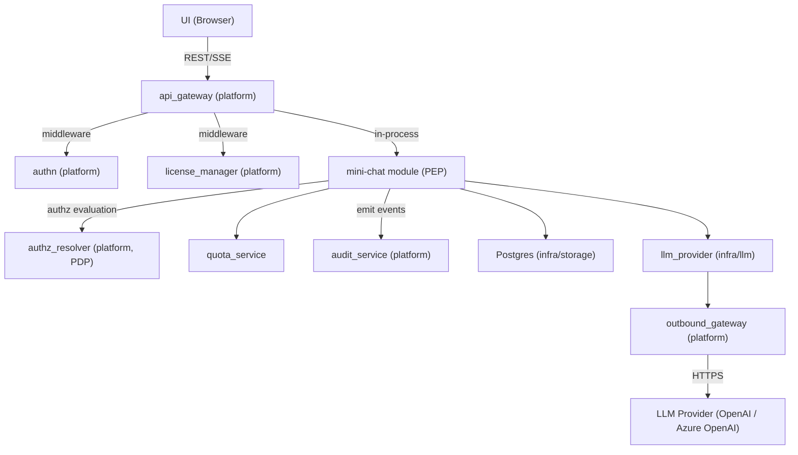
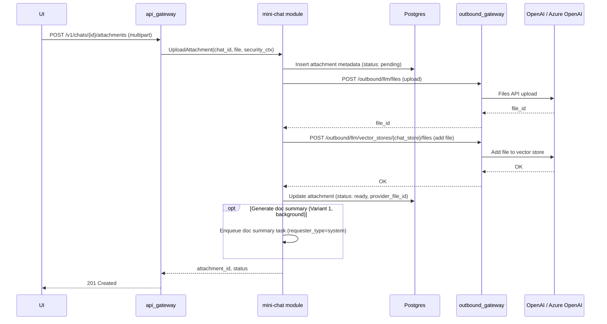
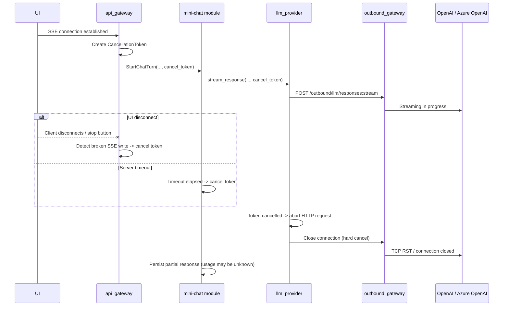
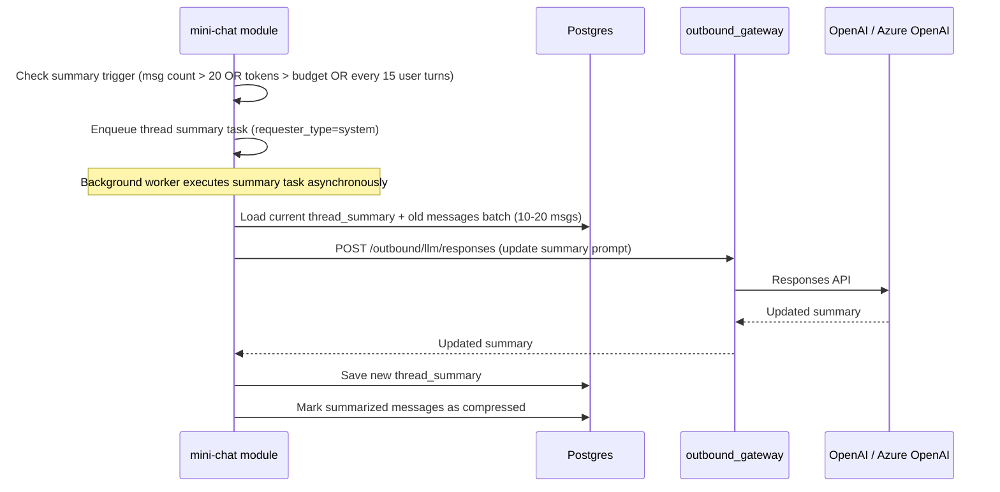

# Technical Design: Mini Chat

## 1. Architecture Overview

### 1.1 Architectural Vision

Mini Chat provides a multi-tenant AI chat experience with SSE streaming, conversation history, document-aware question answering, and web search. Users interact through a REST/SSE API backed by the Responses API with File Search (OpenAI or Azure OpenAI - see [Provider API Mapping](#provider-api-mapping)). The system maintains strict tenant isolation via per-chat vector stores and enforces cost control through token budgets, usage quotas, and file search limits. Authorization decisions are delegated to the platform's AuthZ Resolver (PDP), which returns query-level constraints compiled to `AccessScope` objects by the mini-chat module acting as the Policy Enforcement Point (PEP).

Mini Chat is implemented as a ModKit module (`mini-chat`) following the DDD-light pattern. The module's domain service layer orchestrates all request processing - context assembly, LLM invocation, streaming relay, and persistence. It owns the full request lifecycle from receiving a user message to persisting the assistant response and usage metrics. External LLM calls route exclusively through the platform's Outbound API Gateway (OAGW), which handles credential injection and egress control. Mini Chat calls the LLM provider directly via OAGW rather than through `cf-llm-gateway`, because it relies on provider-specific features (Responses API, Files API, File Search with vector stores) that the generic gateway does not abstract. Both OpenAI and Azure OpenAI expose a compatible Responses API surface; OAGW routes to the configured provider and injects the appropriate credentials (API key header for OpenAI, `api-key` header or Entra ID bearer token for Azure OpenAI).

Mini Chat supports multimodal Responses API input (text + image) using the provider Files API for image storage. Images are uploaded as attachments, referenced by file ID in the Responses API content array, and are not indexed in vector stores.

Long conversations are managed via thread summaries - a Level 1 compression strategy where older messages are periodically summarized by the LLM, and the summary replaces them in the context window. This keeps token costs bounded while preserving key facts, decisions, and document references.

### 1.2 Architecture Drivers

#### Functional Drivers

| Requirement | Phase | Design Response |
|-------------|-------|-----------------|
| `cpt-cf-mini-chat-fr-chat-streaming` | `p1` | SSE streaming via the mini-chat module's domain service -> OAGW -> Responses API (OpenAI: `POST /v1/responses`; Azure OpenAI: `POST /openai/v1/responses`) |
| `cpt-cf-mini-chat-fr-conversation-history` | `p1` | Postgres (infra/storage) persists all messages; recent messages loaded per request |
| `cpt-cf-mini-chat-fr-file-upload` | `p1` | Upload via OAGW -> Files API (OpenAI: `POST /v1/files`; Azure OpenAI: `POST /openai/files`); metadata persisted via infra/storage repositories; file added to the chat's vector store. P1 uses `purpose="assistants"` for both providers (OpenAI also supports `purpose="user_data"`, but we use `assistants` to keep parity and because the files are used with Vector Stores / File Search). |
| `cpt-cf-mini-chat-fr-image-upload` | `p1` | Image upload via OAGW -> Files API; metadata persisted via infra/storage repositories; NOT added to vector store. Images referenced as multimodal input (file ID) in Responses API calls. Model capability checked before outbound call; `unsupported_media` error if model lacks image support. |
| `cpt-cf-mini-chat-fr-file-search` | `p1` | File Search tool call scoped to the chat's dedicated vector store (identical `file_search` tool on both OpenAI and Azure OpenAI Responses API) |
| `cpt-cf-mini-chat-fr-web-search` | `p1` | Web Search tool included in Responses API request when explicitly enabled via `web_search.enabled` parameter; provider decides invocation; per-message and per-day call limits enforced; global `disable_web_search` kill switch |
| `cpt-cf-mini-chat-fr-doc-summary` | `p1` | See **File Upload** sequence ("Generate doc summary" background variant) and `attachments.doc_summary` schema field |
| `cpt-cf-mini-chat-fr-thread-summary` | `p1` | Periodic LLM-driven summarization of old messages; summary replaces history in context |
| `cpt-cf-mini-chat-fr-chat-crud` | `p1` | REST endpoints for create/list/get/delete chats |
| `cpt-cf-mini-chat-fr-temporary-chat` | `p2` | Toggle temporary flag; scheduled cleanup after 24h |
| `cpt-cf-mini-chat-fr-chat-deletion-cleanup` | `p1` | See **Cleanup on Chat Deletion** |
| `cpt-cf-mini-chat-fr-streaming-cancellation` | `p1` | See **Streaming Cancellation** sequence and quota bounded best-effort debit rules in `quota_service` |
| `cpt-cf-mini-chat-fr-quota-enforcement` | `p1` | See `quota_service` component and `quota_usage` table |
| `cpt-cf-mini-chat-fr-token-budget` | `p1` | See constraint **Context Window Budget** and ContextPlan truncation rules |
| `cpt-cf-mini-chat-fr-license-gate` | `p1` | See constraint **License Gate** and dependency `license_manager (platform)` |
| `cpt-cf-mini-chat-fr-audit` | `p1` | Emit audit events to platform `audit_service` for completed chat turns and policy decisions (one structured event per completed turn) |
| `cpt-cf-mini-chat-fr-ux-recovery` | `p1` | See **Streaming Contract** (Idempotency + reconnect rule) and **Turn Status API** |
| `cpt-cf-mini-chat-fr-turn-mutations` | `p1` | Retry / edit / delete last turn via Turn Mutation API; see **Turn Mutation Rules (P1)** and turn mutation endpoints |
| `cpt-cf-mini-chat-fr-model-selection` | `p1` | User selects model per chat at creation; model locked for conversation lifetime; see constraint `cpt-cf-mini-chat-constraint-model-locked-per-chat` and Model Catalog Configuration |
| `cpt-cf-mini-chat-fr-message-reactions` | `p1` | Binary like/dislike on assistant messages; see `message_reactions` table |
| `cpt-cf-mini-chat-fr-group-chats` | `p2+` | Deferred — see `cpt-cf-mini-chat-adr-group-chat-usage-attribution` |

#### NFR Allocation

| NFR ID | NFR Summary | Allocated To | Design Response | Verification Approach |
|--------|-------------|--------------|-----------------|----------------------|
| `cpt-cf-mini-chat-nfr-tenant-isolation` | Tenant data must never leak across tenants | mini-chat module (domain + infra layers) | Per-chat vector store; all queries scoped via `AccessScope` (owner_col + tenant_col); no user-supplied `file_id` or `vector_store_id` in API | Integration tests with multi-tenant scenarios |
| `cpt-cf-mini-chat-nfr-authz-alignment` | Authorization must follow platform PDP/PEP model | mini-chat module (PEP via PolicyEnforcer) | AuthZ Resolver evaluates every data-access operation; constraints compiled to `AccessScope` objects applied via secure ORM; fail-closed on PDP errors | Integration tests with mock PDP; fail-closed verification tests |
| `cpt-cf-mini-chat-nfr-cost-control` | Predictable and bounded LLM costs | mini-chat module (domain service + quota_service) | Token-based rate limits per tier across multiple periods (4-hourly, daily, monthly) tracked in real-time; premium models have stricter limits, standard models (balanced, cost-efficient) have separate, higher limits; three-tier downgrade cascade (premium → balanced → cost-efficient); file search and web search call limits; token budget per request | Usage metrics dashboard; budget alert tests |
| `cpt-cf-mini-chat-nfr-streaming-latency` | Low time-to-first-token for chat responses | mini-chat module (domain service), OAGW | Direct SSE relay without buffering; cancellation propagation on disconnect | TTFT benchmarks under load; **Disconnect test**: open SSE -> receive 1-2 tokens -> disconnect -> assert provider request closed within 200 ms and active-generation counter decrements; **TTFT delta test**: measure `t_first_token_ui - t_first_byte_from_provider` -> assert platform overhead < 50 ms p99 |
| `cpt-cf-mini-chat-nfr-data-retention` | Deleted chats purged from provider; temporary chat cleanup (P2) | mini-chat module (domain + infra layers) | Scheduled cleanup job; cascade delete to provider files and chat vector stores (OpenAI Files API / Azure OpenAI Files API) | Retention policy compliance tests |
| `cpt-cf-mini-chat-nfr-observability-supportability` | Operational visibility for on-call, SRE, and cost governance | mini-chat module (domain service + quota_service) | `mini_chat_*` Prometheus metrics on all critical paths; stable `request_id` tracing per turn; structured audit events; turn state API (`GET /turns/{request_id}`) | Metric series presence tests; request_id propagation tests; alert rule validation |
| `cpt-cf-mini-chat-nfr-rag-scalability` | Bounded RAG costs and stable retrieval quality | mini-chat module (domain service + infra/storage) | Per-chat document count, file size, and chunk limits; configurable retrieval-k and max retrieved tokens per turn; per-chat dedicated vector stores | Per-chat limit enforcement tests; retrieval latency p95 benchmarks; `mini_chat_retrieval_latency_ms` within threshold |

### 1.3 Architecture Layers

```text
┌───────────────────────────────────────────────────────┐
│  Presentation (api_gateway - platform)                │
│  REST + SSE endpoints, AuthN middleware               │
├───────────────────────────────────────────────────────┤
│  mini-chat module  [#[modkit::module]]                │
│  ┌─────────────────────────────────────────────────┐  │
│  │ API Layer (api/rest/)                           │  │
│  │ Handlers, routes, DTOs, error→Problem mapping   │  │
│  ├─────────────────────────────────────────────────┤  │
│  │ Domain Layer (domain/)                          │  │
│  │ Service (orchestration, PEP, context planning,  │  │
│  │   streaming), repository traits (ports)         │  │
│  │ ┌───────────────┐  ┌──────────────────────────┐ │  │
│  │ │ quota_service │  │ authz (PolicyEnforcer)   │ │  │
│  │ └───────────────┘  └──────────────────────────┘ │  │
│  ├─────────────────────────────────────────────────┤  │
│  │ Infrastructure Layer (infra/)                   │  │
│  │ ┌──────────────────┐  ┌──────────────────────┐  │  │
│  │ │ storage/         │  │ llm/ (llm_provider)  │  │  │
│  │ │ SeaORM entities  │  │ -> OAGW -> OpenAI /  │  │  │
│  │ │ (Scopable)       │  │    Azure OpenAI      │  │  │
│  │ │ ORM repositories │  │                      │  │  │
│  │ │ migrations       │  │                      │  │  │
│  │ └──────────────────┘  └──────────────────────┘  │  │
│  └─────────────────────────────────────────────────┘  │
└───────────────────────────────────────────────────────┘
```

**Naming note**: "the domain service" in this document refers to the module's domain service layer (business logic and PEP orchestration). "infra/storage" refers to the persistence layer (SeaORM entities with `#[derive(Scopable)]` + ORM repository implementations).

| Layer | Responsibility | Technology |
|-------|---------------|------------|
| Presentation | Public REST/SSE API, authentication, routing | Axum (platform api_gateway) |
| API | REST handlers, SSE adapters, routes, DTOs, error→Problem mapping (RFC 9457) | Axum handlers, utoipa |
| Domain | Business rules, orchestration, PEP (PolicyEnforcer), context assembly, streaming relay, quota checks; repository traits (ports) | Rust, `authz_resolver_sdk` |
| Infrastructure | Persistence (SeaORM entities with `#[derive(Scopable)]`, ORM repositories, migrations), LLM communication | SeaORM (Postgres), HTTP client (reqwest) via OAGW |

## 2. Principles & Constraints

### 2.1 Design Principles

#### Tenant-Scoped Everything

- [ ] `p1` - **ID**: `cpt-cf-mini-chat-principle-tenant-scoped`

Every data access is scoped by constraints issued by the AuthZ Resolver (PDP). At P1, chat content is owner-only: the PDP returns `eq` predicates on `owner_tenant_id` and `user_id` that the domain service (PEP, via PolicyEnforcer) compiles to `AccessScope` and applies as SQL WHERE clauses through Secure ORM (`#[derive(Scopable)]`). This replaces application-level tenant/user scoping with a formalized constraint model aligned with the platform's [Authorization Design](../../../docs/arch/authorization/DESIGN.md). Vector stores, file uploads, and quota checks all require tenant context. No API accepts raw `vector_store_id` or `file_id` from the client.

#### Owner-Only Chat Content

- [ ] `p1` - **ID**: `cpt-cf-mini-chat-principle-owner-only-content`

Chat content (messages, attachments, summaries, citations) is accessible only to the owning user within their tenant. Parent tenants / MSP administrators MUST NOT have access to chat content. Admin visibility is limited to aggregated usage and operational metrics.

#### Summary Over History

- [ ] `p1` - **ID**: `cpt-cf-mini-chat-principle-summary-over-history`

The system favors compressed summaries over unbounded message history. Old messages are summarized rather than paginated into the LLM context. This bounds token costs and keeps response quality stable for long conversations.

#### Streaming-First

- [ ] `p1` - **ID**: `cpt-cf-mini-chat-principle-streaming-first`

All LLM responses are streamed. The primary delivery path is SSE from LLM provider (OpenAI / Azure OpenAI) → OAGW → mini-chat module → api_gateway → UI. Non-streaming responses are not supported for chat completion. Both providers use an identical SSE event format for the Responses API.

#### Linear Conversation Model

- [ ] `p1` - **ID**: `cpt-cf-mini-chat-principle-linear-conversation`

Conversations are strictly linear sequences of turns. P1 does not support branching, history forks, or rewriting arbitrary historical messages. Only the most recent turn may be mutated (retry, edit, or delete). This constraint keeps the data model simple, avoids version-graph complexity, and ensures deterministic context assembly for the LLM.

### 2.2 Constraints

#### OpenAI-Compatible Provider (P1)

- [ ] `p1` - **ID**: `cpt-cf-mini-chat-constraint-openai-compatible`

P1 targets the OpenAI-compatible API surface - either **OpenAI** or **Azure OpenAI** as the LLM provider. The active provider is selected per deployment via OAGW configuration; any provider-specific differences are handled in the provider call path (OAGW + `llm_provider`). Multi-provider support (e.g., Anthropic, Google) is deferred.

**Provider parity notes** (Azure OpenAI known limitations at time of writing):
- Azure supports only **one vector store** per `file_search` tool call (sufficient for P1: one vector store per chat).
- `purpose="user_data"` for file uploads is not supported on Azure; use `purpose="assistants"`.
- `vector_stores.search` (client-side manual search) is not exposed on Azure - not used in this design.
- New OpenAI features may appear on Azure with a lag of weeks to months.

**Files API upload field mapping (P1)**: Mini Chat uploads documents and images via the provider Files API through OAGW. Provider-required upload fields (including `purpose`) are controlled by a static, per-provider mapping shipped with deployment configuration; OAGW applies this mapping and does not infer it dynamically.

**Multimodal input (P1)**: image-aware chat uses the Responses API with multimodal input content arrays, not a separate Vision API. Image bytes are stored via the provider Files API and referenced by file ID in the Responses API request. P1 does not use URL-based image inputs because internal S3 storage is not externally reachable by the provider.

**File storage (P1)**: All user files (documents and images) are stored in the LLM provider's storage (OpenAI / Azure OpenAI via Files API). Mini Chat does not operate first-party object storage (no S3 or equivalent). "No persistent file storage" in this context means Mini Chat does not run its own object store — files persist in provider storage until explicitly deleted via the cleanup flow.

#### Model Capability Constraint (Images)

- [ ] `p1` - **ID**: `cpt-cf-mini-chat-constraint-model-image-capability`

Image capability validation is performed during preflight in a strict two-step order:

1. **Resolve effective_model** via the quota downgrade cascade (premium → balanced → cost-efficient), applying kill switches (`disable_premium_tier`, `force_cost_efficient_tier`).
2. **Validate capabilities** of the resolved effective_model against the request content.

```text
effective_model = resolve_effective_model(selected_model, quotas, kill_switches)
if request.has_images && !catalog[effective_model].image_capable:
    return HTTP 415 unsupported_media   # no outbound call
proceed with provider call
```

If the effective_model does not support image input, the domain service MUST reject with `unsupported_media` (HTTP 415) before any provider call. This applies even when the selected_model is image-capable but the effective_model is not (e.g. user selected a premium image-capable model, but quota exhaustion downgraded to a cost-efficient model without image support).

The system MUST NOT silently drop image attachments, strip images from the request, or auto-upgrade to a different model to satisfy the request. Image capability is determined by the `image_capable` flag on the model's entry in the model catalog (see Model Catalog Configuration).

#### Downgrade Decision Matrix

| selected_model image_capable | effective_model image_capable | Request has images | Result |
|------------------------------|-------------------------------|--------------------|--------|
| yes | yes | yes | Proceed |
| yes | yes | no  | Proceed |
| yes | no  | yes | Reject 415 `unsupported_media` |
| yes | no  | no  | Proceed (no images, no conflict) |
| no  | no  | yes | Reject 415 `unsupported_media` |
| no  | no  | no  | Proceed |

The matrix is evaluated after `resolve_effective_model()` and before any provider call.

#### No Credential Storage

- [ ] `p1` - **ID**: `cpt-cf-mini-chat-constraint-no-credentials`

Mini Chat never stores or handles API keys. All external calls go through OAGW, which injects credentials from CredStore.

#### Context Window Budget

- [ ] `p1` - **ID**: `cpt-cf-mini-chat-constraint-context-budget`

Every request must fit within the **effective_model's** context window. The input token budget is:

```text
token_budget = min(configured_max_input_tokens, effective_model_context_limit − reserved_output_tokens)
```

Where:
- `configured_max_input_tokens` — deployment config hard cap
- `effective_model_context_limit` — from model catalog entry for the resolved effective_model (see `context_limit` field)
- `reserved_output_tokens` — `max_output_tokens` configured for the request

When context exceeds the budget, the system truncates in reverse priority: retrieval excerpts first, then document summaries, then old messages (not summary). Thread summary and system prompt are never truncated.

The budget MUST be computed after `resolve_effective_model()` (i.e., after quota downgrade), because a downgraded model may have a smaller context window than the selected_model.

#### License Gate

- [ ] `p1` - **ID**: `cpt-cf-mini-chat-constraint-license-gate`

Access requires the `ai_chat` feature on the tenant license, enforced by the platform's `license_manager` middleware. Requests from unlicensed tenants receive HTTP 403.

#### No Buffering

- [ ] `p1` - **ID**: `cpt-cf-mini-chat-constraint-no-buffering`

No layer in the streaming pipeline may collect the full LLM response before relaying it. Every component — `llm_provider`, the domain service, `api_gateway` — must read one SSE event and immediately forward it to the next layer. Middleware must not buffer response bodies. `.collect()` on the token stream is prohibited in the hot path.

#### Bounded Channels

- [ ] `p1` - **ID**: `cpt-cf-mini-chat-constraint-bounded-channels`

Internal mpsc channels between `llm_provider` → domain service → SSE writer must use bounded buffers (16–64 messages). This provides backpressure: if the consumer is slow, the producer blocks rather than accumulating unbounded memory. Channel capacity is configurable per deployment.

#### Model Locked Per Chat

- [ ] `p1` - **ID**: `cpt-cf-mini-chat-constraint-model-locked-per-chat`

Once a chat is created with a model (user-selected or catalog default), that model becomes the **selected_model** (`chats.model`) and is locked for the lifetime of the conversation. The user MUST NOT be able to change the selected_model within an existing chat.

The **effective_model** is the model actually used for a specific turn. Invariants:

- `selected_model` never changes during chat lifetime.
- `effective_model` may differ from `selected_model` due to automatic downgrade (quota exhaustion) or kill switches (`disable_premium_tier`, `force_cost_efficient_tier`).
- `effective_model` MUST be recorded in:
  - `messages.model` column (per assistant message)
  - SSE `event: done` payload (`effective_model` and `usage.model` fields)
  - audit event payload (`selected_model` + `effective_model`)

**Exception**: quota-driven automatic downgrade within the three-tier cascade IS permitted mid-conversation. This is a system-level decision enforced by `quota_service`, not a user-initiated model switch. The effective_model is recorded on the assistant message (`messages.model`), not on the chat itself.

If a user wants a different model, they create a new chat.

#### Quota Before Outbound

- [ ] `p1` - **ID**: `cpt-cf-mini-chat-constraint-quota-before-outbound`

All product-level quota decisions (block, downgrade, limit) MUST be made in the domain service before any request reaches OAGW. OAGW never makes user-level or tenant-level quota decisions — it is transport + credential broker only. Only the domain service has the business context needed for quota decisions: tenant, user, license tier, model tier, three-tier downgrade cascade, file_search call limits. OAGW sees an opaque HTTP request with no business semantics.

Model selection and lifecycle rules (P1) are defined in the model catalog (deployment configuration) and applied at the module boundary:

- The model catalog, downgrade cascade, and per-tier thresholds MUST be defined in deployment configuration (P1) and are expected to be owned by a platform Settings Service / License Manager layer as the long-term system of record.
- The domain service / `quota_service` is the enforcement point: it MUST deterministically choose the effective model before the outbound call using the three-tier downgrade cascade (premium → balanced → cost-efficient). All tiers have token-based rate limits across 4-hourly, daily, and monthly periods; premium models have stricter limits, standard models (balanced, cost-efficient) have separate, higher limits. When any tier's period quota is exhausted, the system downgrades to the next available tier. When all tiers are exhausted, the system MUST reject with `quota_exceeded` (HTTP 429). The chosen model MUST be surfaced via metrics (`{model}` and `{tier}` labels) and audit.

Global emergency flags / kill switches (P1): operators MUST have a way to immediately reduce cost and risk at runtime via configuration-owned flags.

- `disable_premium_tier` — if enabled, premium-tier models MUST NOT be used; requests that would have used premium MUST begin the downgrade cascade from the balanced tier.
- `force_cost_efficient_tier` — if enabled, all requests MUST use the cost-efficient tier model regardless of quota state or user selection.
- `disable_file_search` — if enabled, `file_search` tool calls MUST be skipped; responses proceed without retrieval.
- `disable_web_search` — if enabled, requests with `web_search.enabled=true` MUST be rejected with HTTP 400 and error code `web_search_disabled` before opening an SSE stream. The system MUST NOT silently ignore the parameter.

Ownership: these flags are owned and operated by platform configuration (P1: deployment config). Long-term, they are expected to be owned by Settings Service / License Manager with privileged operator access.

Hard caps: token budgets (`max_input_tokens`, `max_output_tokens`) MUST remain configurable and can serve as an emergency hard cap lever.

## 3. Technical Architecture

### 3.1 Domain Model

**Technology**: Rust structs

**Core Entities**:

| Entity | Description |
|--------|-------------|
| Chat | A conversation belonging to a user within a tenant. Has title, **selected_model** (locked at creation from catalog; immutable), creation/update timestamps. Temporary flag reserved for P2. |
| Message | A single turn in a chat (role: user/assistant/system). Stores content, token estimate, compression status. Assistant messages record the **effective_model** (the model actually used after quota/policy evaluation). |
| Attachment | File uploaded to a chat (document or image). References provider `file_id` (OpenAI or Azure OpenAI). Documents are linked to the chat's vector store; images are not. Has processing status and `attachment_kind` (`document|image`). |
| ThreadSummary | Compressed representation of older messages in a chat. Replaces old history in the context window. |
| ChatVectorStore | Mapping from `(tenant_id, chat_id)` to provider `vector_store_id` (OpenAI or Azure OpenAI Vector Stores API). One vector store per chat (created on first document upload). Physical and logical isolation are both per chat (see File Search Retrieval Scope). |
| AuditEvent | Structured event emitted to platform `audit_service`: prompt, response, user/tenant, timestamps, policy decisions, usage. Not stored locally. |
| QuotaUsage | Per-user usage counters for rate limiting and budget enforcement. Tracks 4-hourly, daily, and monthly periods per tier. Premium models have stricter limits; standard models (balanced, cost-efficient) have separate, higher limits. |
| MessageReaction | A binary like or dislike reaction on an assistant message. One reaction per user per message. Stored for analytics and feedback collection. |
| ContextPlan | Transient object assembled per request: system prompt, summary, doc summaries, recent messages, user message, retrieval excerpts. |

**Relationships**:
- Chat -> Message: 1..\*
- Chat -> Attachment: 0..\*
- Chat -> ThreadSummary: 0..1
- Attachment -> ChatVectorStore: belongs to (via chat_id)
- Message -> AuditEvent: 1..1 (each turn emits an audit event to platform `audit_service`)
- Message -> MessageReaction: 0..1 (per user)

### 3.2 Component Model



**Components**:

- [ ] `p1` - **ID**: `cpt-cf-mini-chat-component-chat-service`

- **mini-chat module** — A ModKit module (`#[modkit::module(name = "mini-chat", deps = ["authz-resolver"], capabilities = [db, rest])]`). The domain service layer is the core orchestrator and Policy Enforcement Point (PEP): receives user messages, evaluates authorization via AuthZ Resolver (PolicyEnforcer → AccessScope), builds context plan, invokes LLM via `llm_provider`, relays streaming tokens, persists messages and usage via infra/storage repositories, triggers thread summary updates.

- [ ] `p1` - **ID**: `cpt-cf-mini-chat-component-chat-store`

- **infra/storage** — SeaORM persistence layer with `#[derive(Scopable)]` entities, ORM repositories, and migrations. All queries are scoped via `AccessScope` (compiled from PolicyEnforcer decisions). Source of truth for chats, messages, attachments, thread summaries, chat vector store mappings, and quota usage.

- [ ] `p1` - **ID**: `cpt-cf-mini-chat-component-llm-provider`

- **llm_provider** — Library residing in `infra/llm/` within the module (not a standalone service). Builds requests for the Responses API (OpenAI or Azure OpenAI — both expose a compatible surface), parses SSE streams, maps errors. Propagates tenant/user metadata via `user` and `metadata` fields on every request (see section 4: Provider Request Metadata). Handles both streaming chat and non-streaming calls (summary generation, doc summary). The library is provider-agnostic at the API contract level; OAGW handles endpoint routing and credential injection per configured provider.

- [ ] `p1` - **ID**: `cpt-cf-mini-chat-component-quota-service`

- **quota_service** — Enforces per-user token-based rate limits per tier across multiple periods (4-hourly, daily, monthly), tracked in real-time. Premium models have stricter limits; standard models (balanced and cost-efficient tiers) have separate, higher limits. Tracks per-tier call counts, file search call counts, web search call counts, and image usage counters (image_inputs, image_upload_bytes) separately. Uses **two-phase quota counting**:

  **Tier availability rule**: a tier is considered **available** only if it has remaining quota in **ALL** configured periods for that tier. If **ANY** period is exhausted, the tier is treated as exhausted and the downgrade cascade continues to the next tier. When all tiers are exhausted, the system rejects with `quota_exceeded`.

  - **Phase 1 - Preflight (reserve) estimate** (on request start, before any streaming begins and before outbound call): estimate token cost from `ContextPlan` size + `max_output_tokens` and reserve it for quota enforcement. Decision: allow at requested tier / downgrade to next tier / reject if all tiers exhausted.
    - Reserve MUST prevent parallel requests from overspending remaining tier quota.
    - Reserve SHOULD be keyed by `(tenant_id, user_id, period_type, period_start)` and reconciled on terminal outcome. Reserves MUST be checked across all three period types (`4h`, `daily`, `monthly`) for the current tier; if any period is exhausted, the tier is considered exhausted and the cascade proceeds to the next tier.
  - **Phase 2 - Commit actual** (on `event: done`): reconcile the reserve to actual usage (`response.usage.input_tokens` + `response.usage.output_tokens`) and commit actual to `quota_usage`. If actual exceeds estimate (overshoot), the completed response is never retroactively cancelled, but guardrails apply:
    - Commit MUST be atomic per `(tenant_id, user_id, period_type, period_start)` (avoid race conditions under parallel streams)
    - If the remaining quota for a tier is below a configured negative threshold, preflight MUST downgrade new requests to the next tier in the cascade
    - `max_output_tokens` and an explicit input budget MUST bound the maximum cost per request
  - **Streaming constraint**: quota check is preflight-only. Mid-stream abort due to quota is NOT supported (would produce broken UX and partial content). Mid-stream abort is only triggered by: user cancel, provider error, or infrastructure limits.

Preflight failures MUST be returned as normal JSON HTTP errors and MUST NOT open an SSE stream.

Cancel/disconnect rule: if a stream ends without a terminal `done`/`error` event, `quota_service` MUST commit a bounded best-effort debit (default: the reserved estimate) so cancellations cannot evade quotas.

Reserve is an internal accounting concept (it may be implemented as held/pending fields or a row-level marker), but the observable external semantics MUST match the rules above.

Background tasks (thread summary update, document summary generation) MUST run with `requester_type=system` and MUST NOT be charged to an arbitrary end user. Usage for these tasks is charged to a tenant operational bucket (implementation-defined) and still emitted to `audit_service`.

Background/system tasks MUST NOT create `chat_turns` records. `chat_turns` idempotency and replay semantics apply only to user-initiated streaming turns.

- [ ] `p1` - **ID**: `cpt-cf-mini-chat-component-authz-integration`

- **authz_resolver (PDP)** — Platform AuthZ Resolver module. The mini-chat domain service calls it (via PolicyEnforcer) before every data-access operation to obtain authorization decisions and SQL-compilable constraints. See section 3.8.


### 3.3 API Contracts

- [ ] `p1` - **ID**: `cpt-cf-mini-chat-interface-public-api`
Covers public API from PRD: `cpt-cf-mini-chat-interface-public-api`

**Technology**: REST/OpenAPI, SSE

**Endpoints Overview**:

| Method | Path | Description | Stability |
|--------|------|-------------|-----------|
| `POST` | `/v1/chats` | Create a new chat | stable |
| `GET` | `/v1/chats` | List chats for current user | stable |
| `GET` | `/v1/chats/{id}` | Get chat metadata + recent messages | stable |
| `DELETE` | `/v1/chats/{id}` | Delete chat (with retention cleanup) | stable |
| `POST` | `/v1/chats/{id}:temporary` | Toggle temporary flag (24h TTL) | P2 |
| `POST` | `/v1/chats/{id}/messages:stream` | Send message, receive SSE stream | stable |
| `POST` | `/v1/chats/{id}/attachments` | Upload file attachment | stable |
| `GET` | `/v1/chats/{id}/turns/{request_id}` | Get authoritative turn status (read-only) | stable |
| `POST` | `/v1/chats/{id}/turns/{request_id}:retry` | Retry last turn (new generation) | stable |
| `PATCH` | `/v1/chats/{id}/turns/{request_id}` | Edit last turn (replace content + regenerate) | stable |
| `DELETE` | `/v1/chats/{id}/turns/{request_id}` | Delete last turn (soft-delete) | stable |
| `PUT` | `/v1/chats/{id}/messages/{msg_id}/reaction` | Set like/dislike reaction on an assistant message | stable |
| `DELETE` | `/v1/chats/{id}/messages/{msg_id}/reaction` | Remove reaction from an assistant message | stable |

**Create Chat** (`POST /v1/chats`):

Request body:
```json
{
  "title": "string (optional)",
  "model": "string (optional, defaults to catalog default)"
}
```

- `model`: If provided, MUST reference a valid model `name` in the model catalog. If absent, the system uses the first entry in the model catalog as the default. The model is stored on the chat and locked for all subsequent messages (see `cpt-cf-mini-chat-constraint-model-locked-per-chat`). Returns HTTP 400 if the model name is not in the catalog.

Response includes the resolved `model` in chat metadata.

**Streaming Contract** (`POST /v1/chats/{id}/messages:stream`) — **ID**: `cpt-cf-mini-chat-contract-sse-streaming`:

The SSE protocol below is the **stable public contract** between the mini-chat module and UI clients. Provider-specific streaming events (OpenAI/Azure OpenAI Responses API) are translated internally by `llm_provider` / the domain service and are never exposed to clients. See [Provider Event Translation](#provider-event-translation).

**Error model (Option A)**: If request validation, authorization, or quota preflight fails before any streaming begins, the system MUST return a normal JSON error response with the appropriate HTTP status and MUST NOT open an SSE stream. If a failure occurs after streaming has started, the system MUST terminate the stream with a terminal `event: error`.

Request body:
```json
{
  "content": "string",
  "request_id": "uuid (client-generated, optional)",
  "attachment_ids": ["uuid (optional)"],
  "web_search": { "enabled": false }
}
```

`web_search` is an optional object controlling web search for this turn. Defaults to `{ "enabled": false }` when omitted (backward compatible). When `web_search.enabled=true`, the backend includes the `web_search` tool in the provider Responses API request. The provider decides whether to invoke the tool. If the global `disable_web_search` kill switch is active, the request is rejected with HTTP 400 and error code `web_search_disabled` before opening an SSE stream.

`attachment_ids` is an optional list of **attachment IDs** to include as input on the current turn. P1 supports image attachments only. Validation MUST ensure all of the following:

- `attachments.tenant_id` matches the request security context tenant
- The owning chat's `user_id` matches the request security context user
- `attachments.chat_id` matches the requested `chat_id`
- `attachments.status == ready`

**Idempotency**: The idempotency key is `(chat_id, request_id)`. Behavior when `request_id` is provided:

| State | Server behavior |
|-------|----------------|
| Active generation exists for key | Return `409 Conflict` (JSON error response; no SSE stream is opened). (P2+: attach to existing stream.) |
| Completed generation exists for key | Return a fast replay SSE stream without triggering a new provider request: one `delta` event containing the full persisted assistant text, then `citations` if available, then `done`. |
| No record for key | Start a new generation normally. |

If `request_id` is omitted, the server treats the request as non-idempotent (no replay semantics).

The UI MUST generate a new `request_id` per user send action. The UI MUST NOT auto-retry with the same `request_id` unless it intends to resume/retrieve the same generation.

Active generation detection and completed replay are based on a durable `chat_turns` record (see section 3.7). `messages.request_id` uniqueness alone is not sufficient to represent `running` state.

Reconnect rule (P1): if the SSE stream disconnects before a terminal `done`/`error`, the UI MUST NOT automatically retry `POST /messages:stream` with the same `request_id` (it will most likely hit `409 Conflict`). The UI should treat the send as indeterminate and require explicit user action (resend with a new `request_id`).

**P1 optional, recommended**: expose a read API for turn state backed by `chat_turns` (for example `GET /v1/chats/{id}/turns/{request_id}`) so support and UI recovery flows can query authoritative turn state rather than inferring it from client retry outcomes.

#### Turn Status API (P1 optional, recommended) — **ID**: `cpt-cf-mini-chat-interface-turn-status`

To support reconnect UX and reduce support reliance on direct DB inspection, the service SHOULD expose a read-only turn status endpoint backed by `chat_turns`.

**Endpoint**: `GET /v1/chats/{id}/turns/{request_id}`

**Response**:

- `chat_id`
- `request_id`
- `state`: `running|done|error|cancelled`
- `updated_at`

**Internal-to-API state mapping**:

| Internal State (`chat_turns.state`) | Turn Status API | SSE Terminal Event |
|-------------------------------------|-----------------|-------------------|
| `running` | `running` | _(not terminal)_ |
| `completed` | `done` | `done` |
| `failed` | `error` | `error` |
| `cancelled` | `cancelled` | _(none; stream already disconnected)_ |

- API `done` corresponds to internal `chat_turns.state = completed` and terminal `event: done`
- API `error` corresponds to internal `chat_turns.state = failed` and terminal `event: error`
- API `cancelled` corresponds to internal `chat_turns.state = cancelled` and indicates cancellation was processed; the UI should treat it as terminal and allow resend with a new `request_id`

UI guidance: if the SSE stream disconnects before a terminal event, the UI SHOULD show a user-visible banner: "Message delivery uncertain due to connection loss. You can resend." Resend MUST use a new `request_id`.

#### SSE Event Definitions

Six event types. The stream always ends with exactly one terminal event: `done` or `error`. Image-bearing turns use the same event types; no new SSE events are required for image support. The `citations` event remains exclusive to file_search results; image inputs do not produce citations.

##### `event: delta`

Streams incremental assistant output.

```
event: delta
data: {"type": "text", "content": "partial text"}

event: delta
data: {"type": "text", "content": " more text"}
```

| Field | Type | Description |
|-------|------|-------------|
| `type` | string | Output type. P1: always `"text"`. Reserved for future types (e.g., `"markdown"`, `"structured"`). |
| `content` | string | Incremental text fragment. |

##### `event: tool`

Reports tool activity (file_search and web_search at P1).

```
event: tool
data: {"phase": "start", "name": "file_search", "details": {}}

event: tool
data: {"phase": "done", "name": "file_search", "details": {"files_searched": 3}}
```

| Field | Type | Description |
|-------|------|-------------|
| `phase` | `"start"` \| `"progress"` \| `"done"` | Lifecycle phase of the tool call. |
| `name` | string | Tool identifier. P1: `"file_search"`, `"web_search"`. |
| `details` | object | Tool-specific metadata. MUST be non-sensitive and tenant-safe. Content is minimal and stable at P1. |

##### `event: citations`

Delivers source references used in the answer.

```
event: citations
data: {"items": [{"source": "file", "title": "Q3 Report.pdf", "attachment_id": "uuid", "file_id": "file-abc123", "snippet": "Revenue grew 15%...", "score": 0.92}]}
```

| Field | Type | Description |
|-------|------|-------------|
| `items[].source` | `"file"` \| `"web"` | Citation source type. |
| `items[].title` | string | Document or page title. |
| `items[].url` | string (optional) | URL for web sources. |
| `items[].attachment_id` | UUID (optional) | Internal attachment identifier for file sources. Preferred identifier for UI references. |
| `items[].file_id` | string (optional) | Provider file ID for file sources. |
| `items[].span` | object (optional) | Reserved for mapping citations to the final assistant text. If provided: `{ "start": number, "end": number }` character offsets into the full assistant output. |
| `items[].snippet` | string | Relevant excerpt. |
| `items[].score` | number (optional) | Relevance score (0-1). |

`items[].file_id` is provider-issued and MUST be treated as opaque display-only metadata. Clients MUST NOT send it back to any API.

P1: `citations` is sent once near stream completion, before `done`. The contract supports multiple `citations` events per stream for future use. When web search contributes to the response, citations with `source: "web"` include `url`, `title`, and `snippet`.

##### `event: done`

Finalizes the stream. Provides usage, model selection, and provider correlation metadata.

```json
{
  "message_id": "uuid",
  "usage": {
    "input_tokens": 500,
    "output_tokens": 120,
    "model": "gpt-5.2"
  },
  "effective_model": "gpt-5.2",
  "selected_model": "gpt-5.2-premium",
  "quota_decision": "downgrade",
  "downgrade_from": "gpt-5.2-premium",
  "downgrade_reason": "premium_quota_exhausted",
  "provider": {
    "name": "openai",
    "response_id": "resp_abc123"
  }
}
```

| Field | Type | Description |
|-------|------|-------------|
| `message_id` | UUID | Persisted assistant message ID. |
| `usage.input_tokens` | number | Actual input tokens consumed. |
| `usage.output_tokens` | number | Actual output tokens consumed. |
| `usage.model` | string | Effective model used for generation (same value as top-level `effective_model`; kept for backward compatibility). |
| `effective_model` | string | Model actually used for this turn after quota and policy evaluation. Always present. |
| `selected_model` | string | Model chosen at chat creation (`chats.model`). Always present. Equals `effective_model` when no downgrade occurred. |
| `quota_decision` | `"allow"` \| `"downgrade"` (required) | Always present. `"allow"` when the turn used the selected model without override; `"downgrade"` when a quota-driven downgrade occurred. |
| `downgrade_from` | string (optional) | Always equals `selected_model` when present — the model from which the quota-driven downgrade occurred. Present only when `quota_decision="downgrade"`. |
| `downgrade_reason` | string (optional) | Why downgrade occurred: `"premium_quota_exhausted"`, `"balanced_quota_exhausted"`, or `"kill_switch"`. Present only when `quota_decision="downgrade"`. |
| `provider.name` | `"openai"` \| `"azure_openai"` | Active provider. |
| `provider.response_id` | string | Provider-side response ID for debugging and OAGW log correlation. |

##### `event: error`

Terminates the stream with an application error. No further events follow.

```
event: error
data: {"code": "quota_exceeded", "message": "Daily limit reached"}
```

| Field | Type | Description |
|-------|------|-------------|
| `code` | string | Canonical error code (see table below). |
| `message` | string | Human-readable description. |

##### `event: ping`

Keepalive to prevent idle-timeout disconnects by proxies and browsers (especially when the model is "thinking" before producing tokens). Sent every 15-30 seconds during generation. Clients MUST ignore `ping` events.

```
event: ping
data: {}
```

#### SSE Event Ordering

A well-formed stream follows this ordering:

```text
ping*  (delta | tool | citations)*  (done | error)
```

- Zero or more `ping` events may appear at any point.
- `delta`, `tool`, and `citations` events may interleave in any order.
- Exactly one terminal event (`done` or `error`) ends the stream.

<a id="provider-event-translation"></a>
#### Provider Event Translation

Provider-specific streaming events are internal to `llm_provider` and the domain service. They are never forwarded to clients. The translation layer maps provider events to the stable SSE protocol defined above.

| Provider Event | Stable SSE Event | Notes |
|----------------|-----------------|-------|
| `response.output_text.delta` | `event: delta` (`type: "text"`) | Text content mapped 1:1. |
| `response.file_search_call.searching` | `event: tool` (`phase: "start"`, `name: "file_search"`) | Emitted when file_search tool is invoked. |
| `response.file_search_call.completed` | `event: tool` (`phase: "done"`, `name: "file_search"`) | `details` populated from search results metadata. |
| `response.web_search_call.searching` | `event: tool` (`phase: "start"`, `name: "web_search"`) | Emitted when web_search tool is invoked by the provider. |
| `response.web_search_call.completed` | `event: tool` (`phase: "done"`, `name: "web_search"`) | `details` populated from search results metadata. |
| Web search annotations in response | `event: citations` | Extracted from provider annotations, mapped to `items[]` with `source: "web"`, `url`, `title`, `snippet`. |
| File search annotations in response | `event: citations` | Extracted from provider annotations, mapped to `items[]` schema. When provider annotations include ranges, `items[].span` SHOULD be populated as character offsets into the final assistant text. |
| `response.completed` | `event: done` | `usage` from `response.usage`; `provider.response_id` from `response.id`. |
| Provider HTTP error / disconnect | `event: error` (`code: "provider_error"` or `"provider_timeout"`) | Error details sanitized; provider internals not exposed. |
| Provider 429 | `event: error` (`code: "rate_limited"`) | After OAGW retry exhaustion. |

This mapping is intentionally provider-agnostic in the stable contract. If the provider changes its event format or a new provider is added, only the translation layer in `llm_provider` is updated. The client contract remains unchanged.

**Error Codes**:

For streaming endpoints, failures before any streaming begins MUST be returned as normal JSON HTTP error responses. Once the stream has started, failures MUST be reported via a terminal `event: error`.

**HTTP status policy (P1)**: request validation errors use HTTP 400; payload size / byte-limit rejections use HTTP 413; unsupported file types or unsupported media use HTTP 415.

| Code | HTTP Status | Description |
|------|-------------|-------------|
| `feature_not_licensed` | 403 | Tenant lacks `ai_chat` feature |
| `insufficient_permissions` | 403 | Subject lacks permission for the requested action (AuthZ Resolver denied) |
| `chat_not_found` | 404 | Chat does not exist or not accessible under current authorization constraints |
| `quota_exceeded` | 429 | User exceeded token rate limits across all tiers (premium, balanced, cost-efficient) in at least one period, or emergency flags force rejection, or all models are disabled |
| `web_search_disabled` | 400 | Request includes `web_search.enabled=true` but the global `disable_web_search` kill switch is active |
| `rate_limited` | 429 | Too many requests in time window |
| `file_too_large` | 413 | Uploaded file exceeds size limit |
| `unsupported_file_type` | 415 | File type not supported for upload |
| `too_many_images` | 400 | Request includes more than the configured maximum images for a single turn |
| `image_bytes_exceeded` | 413 | Request includes images whose total configured per-turn byte limit is exceeded |
| `unsupported_media` | 415 | Request includes image input but the effective model does not support multimodal input |
| `provider_error` | 502 | LLM provider returned an error |
| `provider_timeout` | 504 | LLM provider request timed out |

### 3.4 Internal Dependencies

| Dependency Module | Interface Used | Purpose |
|-------------------|----------------|---------|
| api_gateway (platform) | Axum router / middleware | HTTP request handling, SSE transport |
| authn (platform) | Middleware (JWT/opaque token) | Extract `user_id` + `tenant_id` from request |
| license_manager (platform) | Middleware | Check tenant has `ai_chat` feature; reject with 403 if not |
| authz_resolver (platform) | Access evaluation API (`/access/v1/evaluation`) | Obtain authorization decisions + SQL-compilable constraints for chat operations |
| audit_service (platform) | Event emitter | Receive structured audit events (prompts, responses, usage, policy decisions, `selected_model`, `effective_model`) |
| outbound_gateway (platform) | Internal HTTP | Egress to LLM provider (OpenAI / Azure OpenAI) with credential injection |

**Dependency Rules**:
- The mini-chat module never calls the LLM provider (OpenAI / Azure OpenAI) directly; all external calls go through OAGW
- `SecurityContext` (user_id, tenant_id) propagated through all in-process calls
- `license_manager` runs as middleware before the module is invoked
- The domain service calls `authz_resolver` (via PolicyEnforcer) before every database query; on PDP denial or PDP unreachable, fail-closed (deny access)
- The domain service emits audit events to `audit_service` after each turn; mini-chat does not store audit data locally

### 3.5 External Dependencies

#### LLM Provider (OpenAI / Azure OpenAI)

Both providers expose a compatible API surface. OAGW routes requests to the configured provider and injects credentials accordingly.

| API | Purpose | OAGW Route | OpenAI Endpoint | Azure OpenAI Endpoint |
|-----|---------|------------|-----------------|----------------------|
| Responses API (streaming) | Chat completion with tool support | `POST /outbound/llm/responses:stream` | `POST https://api.openai.com/v1/responses` | `POST https://{resource}.openai.azure.com/openai/v1/responses` |
| Responses API (non-streaming) | Thread summary generation, doc summary | `POST /outbound/llm/responses` | `POST https://api.openai.com/v1/responses` | `POST https://{resource}.openai.azure.com/openai/v1/responses` |
| Files API | Upload user documents and images | `POST /outbound/llm/files` | `POST https://api.openai.com/v1/files` | `POST https://{resource}.openai.azure.com/openai/files` |
| Vector Stores API | Manage per-chat vector stores, add/remove files | `POST /outbound/llm/vector_stores/*` | `POST https://api.openai.com/v1/vector_stores/*` | `POST https://{resource}.openai.azure.com/openai/v1/vector_stores/*` |
| File Search (tool) | Retrieve document excerpts during chat | - (invoked as tool within Responses API call) | `file_search` tool | `file_search` tool (identical contract) |

Note: Azure OpenAI path variants differ by rollout; OAGW owns the exact path mapping for each API.

<a id="provider-api-mapping"></a>
**Provider API Mapping** - authentication and endpoint differences:

| Aspect | OpenAI | Azure OpenAI |
|--------|--------|--------------|
| **Base URL** | `https://api.openai.com/v1` | `https://{resource}.openai.azure.com/openai/v1` |
| **Authentication** | `Authorization: Bearer {api_key}` | `api-key: {key}` header or Entra ID bearer token |
| **API version** | Not required | Azure may require an `api-version` query parameter depending on feature/rollout; OAGW owns this provider-specific detail |
| **File upload `purpose` (documents)** | `assistants` (P1) | `assistants` only (`user_data` not supported) |
| **File upload `purpose` (images)** | `vision` (when required by the configured endpoint/model) | `assistants` |
| **Vector stores per `file_search`** | Multiple | **One** (sufficient for P1: one store per tenant) |
| **SSE format** | `event:` + `data:` lines, structured events | Identical format |
| **`user` field** | Supported | Supported (feeds into Azure abuse monitoring) |
| **`metadata` object** | Supported | Supported |

OAGW MUST inject the required `api-version` query parameter when calling Azure OpenAI endpoints.

**OAGW throttling scope**: OAGW handles provider-side rate limiting only - retry on provider 429 (with `Retry-After` respect, max 1 retry), circuit breaker when provider error rate exceeds threshold, and global concurrency cap as an SRE safety valve. Product-level quota enforcement (per-user, per-tenant, model downgrade) is NOT an OAGW concern — it is handled entirely by the domain service / `quota_service` before any outbound call (see constraint `cpt-cf-mini-chat-constraint-quota-before-outbound`).

#### PostgreSQL

| Usage | Purpose |
|-------|---------|
| Primary datastore | Chats, messages, attachments, summaries, quota counters, chat vector store mappings |

### 3.6 Interactions & Sequences

#### Send Message with Streaming Response

- [ ] `p1` - **ID**: `cpt-cf-mini-chat-seq-send-message`

```mermaid
sequenceDiagram
    participant UI
    participant AG as api_gateway
    participant AuthZ as authz_resolver (PDP)
    participant CS as mini-chat module (PEP)
    participant DB as Postgres
    participant OG as outbound_gateway
    participant OAI as OpenAI / Azure OpenAI

    UI->>AG: POST /v1/chats/{id}/messages:stream
    AG->>AG: AuthN + license_manager
    AG->>CS: StartChatTurn(chat_id, user_msg, security_ctx)
    CS->>AuthZ: Evaluate(subject, action: "send_message", resource: {type: chat, id: chat_id})
    AuthZ-->>CS: decision + constraints

    alt PDP unreachable / timeout
        CS-->>AG: 403 Forbidden (JSON error response; no SSE stream is opened)
        AG-->>UI: 403
    else decision = false
        CS-->>AG: 404 Not Found (JSON error response; no SSE stream is opened)
        AG-->>UI: 404
    end

    CS->>DB: Load chat, recent messages, thread_summary, attachments, chat vector_store_id (with constraints in WHERE)

    alt 0 rows returned
        CS-->>AG: 404 Not Found (JSON error response; no SSE stream is opened)
        AG-->>UI: 404
    end

    CS->>CS: Build ContextPlan (system prompt + summary + doc summaries + recent msgs + user msg)
    CS->>CS: Preflight (reserve) quota check (resolve model from chat.model, check quota across all tiers 4h/daily/monthly -> allow at tier / downgrade / reject)

    alt all tiers exhausted or all models disabled (emergency flags)
        CS-->>AG: 429 quota_exceeded (JSON error response; no SSE stream is opened)
        AG-->>UI: 429
    end

    alt web_search.enabled=true AND disable_web_search kill switch active
        CS-->>AG: 400 web_search_disabled (JSON error response; no SSE stream is opened)
        AG-->>UI: 400
    end

    Note over CS, OAI: Single provider call per user turn. file_search is always enabled as a tool. web_search is included when web_search.enabled=true.

    CS->>OG: POST /outbound/llm/responses:stream (tools include file_search + optionally web_search, store=user_store, filtered to chat attachments)
    OG->>OAI: Responses API (streaming, tool calling enabled)
    OAI-->>OG: SSE tokens
    OG-->>CS: Token stream
    CS-->>AG: Token stream
    AG-->>UI: SSE tokens

    CS->>DB: Persist user msg + assistant msg + usage
    CS->>CS: Commit actual usage to quota_service (debit input_tokens + output_tokens)

    participant AS as audit_service
    CS->>AS: Emit audit event (selected_model, effective_model, usage, policy decisions)

    opt Thread summary update triggered (background)
        CS->>CS: Enqueue thread summary task (requester_type=system)
    end
```

**Description**: Full lifecycle of a user message - from authorization through streaming LLM response to persistence and optional thread compression. Authorization is evaluated before any database access. The PEP sends an evaluation request to the AuthZ Resolver with the chat's resource type and ID; the returned constraints are applied to the DB query's WHERE clause. If the PDP is unreachable, the request is rejected immediately (fail-closed, 403). If the PDP denies access for an operation with a concrete `chat_id`, the PEP returns 404 to avoid disclosing resource existence. If the constrained query returns 0 rows, the PEP returns 404.

#### File Upload

- [ ] `p1` - **ID**: `cpt-cf-mini-chat-seq-file-upload`



**Description**: File upload flow - the file is uploaded to the LLM provider (OpenAI or Azure OpenAI) via OAGW. The subsequent steps depend on attachment kind:

- **Document** (`attachment_kind=document`): file is added to the chat's vector store (created on first upload), optionally summarized, and metadata is persisted locally. Status transitions: `pending` -> `ready`.
- **Image** (`attachment_kind=image`): file is uploaded to the provider via Files API but is NOT added to the vector store and NOT summarized. Status transitions: `pending` -> `ready`. The image is available for multimodal input in subsequent Responses API calls via its `provider_file_id`.

Attachment kind is derived from `content_type`: MIME types matching `image/png`, `image/jpeg`, or `image/webp` are classified as `image`; all other supported types are classified as `document`.

#### Streaming Cancellation

- [ ] `p1` - **ID**: `cpt-cf-mini-chat-seq-cancellation`



**Description**: Cancellation propagates end-to-end via a shared `CancellationToken`. When triggered, `llm_provider` performs a hard cancel - aborting the outbound HTTP connection so the LLM provider (OpenAI / Azure OpenAI) stops generating immediately. The partial response is persisted. Because provider usage is typically only delivered on a completed response, `input_tokens`/`output_tokens` may be NULL or approximate for cancelled turns; quota enforcement uses the bounded best-effort debit described in `quota_service`.

#### Thread Summary Update

- [ ] `p1` - **ID**: `cpt-cf-mini-chat-seq-thread-summary`



**Description**: Thread summary is updated asynchronously after a chat turn when trigger conditions are met. Summary generation is a background task and MUST be attributed as `requester_type=system` so that its usage is not charged to an arbitrary end user.

Summary quality gate (P1): the system MUST detect and mitigate obviously-bad summaries without ML-based evaluation.

- After generating a summary, the domain service MUST validate the candidate summary text.
- If summary length < `X` OR entropy < `Y`, the domain service MUST attempt regeneration.
- If regeneration fails quality checks or the provider call fails, the domain service MUST fall back by keeping the previous summary unchanged and MUST NOT mark the message batch as compressed.

`X` and `Y` are configurable thresholds. Entropy is a deterministic proxy computed as normalized token entropy over whitespace-delimited tokens:

`H_norm = (-sum(p_i * log2(p_i))) / log2(N)` where `p_i` is the empirical frequency of token `i` and `N` is the number of distinct tokens.

Observability:

- Increment `mini_chat_summary_regen_total{reason}` for each regeneration attempt (`reason` from a bounded allowlist such as `too_short|low_entropy|provider_error|invalid_format`).
- Increment `mini_chat_summary_fallback_total` when the fallback behavior above is used.

### 3.7 Database Schemas & Tables

**Primary database engine**: PostgreSQL. All schema definitions below use PostgreSQL types (`UUID`, `TIMESTAMPTZ`, `JSONB`, `TEXT`). SQL constructs are kept ANSI-compatible where feasible to simplify a potential MariaDB migration set in the future (e.g. `UUID` → `CHAR(36)`, `TIMESTAMPTZ` → `DATETIME`, `JSONB` → `JSON`). P1 ships PostgreSQL migrations only; MariaDB support can be added as a separate migration set if required.

#### Table: chats

- [ ] `p1` - **ID**: `cpt-cf-mini-chat-dbtable-chats`

| Column | Type | Description |
|--------|------|-------------|
| id | UUID | Chat identifier |
| tenant_id | UUID | Owning tenant |
| user_id | UUID | Owning user |
| model | VARCHAR(64) | **selected_model**: model chosen at chat creation, immutable for the chat lifetime. Must reference a valid entry in the model catalog. Defaults to catalog default if not specified at creation. |
| title | VARCHAR(255) | Chat title (user-set or auto-generated) |
| is_temporary | BOOLEAN | If true, auto-deleted after 24h (P2; default false at P1) |
| created_at | TIMESTAMPTZ | Creation time |
| updated_at | TIMESTAMPTZ | Last activity time |
| deleted_at | TIMESTAMPTZ | Soft delete timestamp (nullable) |

**PK**: `id`

**Constraints**: NOT NULL on `tenant_id`, `user_id`, `created_at`

**Indexes**: `(tenant_id, user_id, updated_at DESC)` for listing chats

**Secure ORM**: `#[secure(tenant_col = "tenant_id", owner_col = "user_id", resource_col = "id", no_type)]`

#### Table: messages

- [ ] `p1` - **ID**: `cpt-cf-mini-chat-dbtable-messages`

| Column | Type | Description |
|--------|------|-------------|
| id | UUID | Message identifier |
| chat_id | UUID | Parent chat (FK -> chats.id) |
| request_id | UUID | Client-generated idempotency key (nullable). Used for completed replay and traceability. Running state is tracked in `chat_turns`. |
| role | VARCHAR(16) | `user`, `assistant`, or `system` |
| content | TEXT | Message content |
| token_estimate | INTEGER | Estimated token count |
| provider_name | VARCHAR(128) | Provider GTS identifier for assistant messages (nullable). Example: `gts.x.genai.mini_chat.provider.v1~msft.azure.azure_ai.model_api.v1~` |
| provider_response_id | VARCHAR(128) | Provider response ID for assistant messages (nullable) |
| request_kind | VARCHAR(16) | `chat`, `summary`, or `doc_summary` (nullable) |
| features_used | JSONB | Feature flags and counters (nullable) |
| input_tokens | BIGINT | Actual input tokens for assistant messages (nullable) |
| output_tokens | BIGINT | Actual output tokens for assistant messages (nullable) |
| model | VARCHAR(64) | **effective_model**: actual model used for this turn after quota/policy evaluation (nullable; set for assistant messages). May differ from `chats.model` (selected_model) when a downgrade occurred. |
| is_compressed | BOOLEAN | True if included in a thread summary |
| created_at | TIMESTAMPTZ | Creation time |

**PK**: `id`

**Constraints**: NOT NULL on `chat_id`, `role`, `content`, `created_at`. FK `chat_id` -> `chats.id` ON DELETE CASCADE. UNIQUE on `(chat_id, request_id)` WHERE `request_id IS NOT NULL`.

**Indexes**: `(chat_id, created_at)` for loading recent messages

**Secure ORM**: No independent `#[secure]` — accessed through parent chat. Queries are filtered by `chat_id` obtained from a scoped chat query.

#### Table: chat_turns

- [ ] `p1` - **ID**: `cpt-cf-mini-chat-dbtable-chat-turns`

Tracks idempotency and in-progress generation state for `request_id`. This avoids ambiguous interpretation of `messages.request_id` when a generation is still running.

| Column | Type | Description |
|--------|------|-------------|
| id | UUID | Turn identifier |
| chat_id | UUID | Parent chat (FK -> chats.id) |
| request_id | UUID | Client-generated idempotency key |
| requester_type | VARCHAR(16) | `user` or `system` |
| requester_user_id | UUID | User ID when requester_type=`user` (nullable for system) |
| state | VARCHAR(16) | `running`, `completed`, `failed`, `cancelled` |
| provider_name | VARCHAR(128) | Provider GTS identifier (nullable until request starts). Same GTS format as `messages.provider_name`. |
| provider_response_id | VARCHAR(128) | Provider response ID (nullable) |
| assistant_message_id | UUID | Persisted assistant message ID (nullable until completed) |
| error_code | VARCHAR(64) | Terminal error code (nullable) |
| deleted_at | TIMESTAMPTZ | Soft-delete timestamp for turn mutations (nullable). Set when a turn is replaced by retry or edit, or explicitly deleted. |
| replaced_by_request_id | UUID | `request_id` of the new turn that replaced this one via retry or edit (nullable). Stored on the old (soft-deleted) turn to provide audit traceability. Not used by delete. |
| started_at | TIMESTAMPTZ | DB-assigned turn creation timestamp (set on INSERT). Used for ordering and latest-turn selection in P1. |
| completed_at | TIMESTAMPTZ | Completion time (nullable) |
| updated_at | TIMESTAMPTZ | Last update time |

**PK**: `id`

**Constraints**: UNIQUE on `(chat_id, request_id)`. FK `chat_id` -> `chats.id` ON DELETE CASCADE.

**Indexes (P1)**:
- `(chat_id, started_at DESC) WHERE deleted_at IS NULL`

A `chat_turns` row MUST be created before starting the outbound provider request; initial state is `running`.

State machine:
- Allowed transitions: `running` -> `completed` \| `failed` \| `cancelled`
- Terminal states: `completed`, `failed`, `cancelled`
- Terminal states MUST be immutable
- At most one `running` turn per `(chat_id, request_id)`

Soft-delete rules:
- Turns with `deleted_at IS NOT NULL` are excluded from active conversation history and context assembly.
- Soft-deleted turns remain in storage for audit traceability.
- The "latest turn" for mutation eligibility is the turn with the greatest `(started_at, id)` where `deleted_at IS NULL`.

**Secure ORM**: No independent `#[secure]` — accessed through parent chat. Queries are filtered by `chat_id` obtained from a scoped chat query.

#### Table: attachments

- [ ] `p1` - **ID**: `cpt-cf-mini-chat-dbtable-attachments`

| Column | Type | Description |
|--------|------|-------------|
| id | UUID | Attachment identifier |
| tenant_id | UUID | Owning tenant |
| chat_id | UUID | Parent chat (FK -> chats.id) |
| filename | VARCHAR(255) | Original filename |
| content_type | VARCHAR(128) | MIME type |
| size_bytes | BIGINT | File size |
| provider_file_id | VARCHAR(128) | LLM provider file ID - OpenAI `file-*` or Azure OpenAI `assistant-*` (nullable until upload completes) |
| status | VARCHAR(16) | `pending`, `ready`, `failed` |
| attachment_kind | VARCHAR(16) | `document` or `image`. Derived from `content_type` on INSERT: MIME types `image/png`, `image/jpeg`, `image/webp` -> `image`; all others -> `document`. Stored explicitly for efficient query filtering. |
| doc_summary | TEXT | LLM-generated document summary (nullable; always NULL for `attachment_kind=image`) |
| summary_model | VARCHAR(64) | Model used to generate the summary (nullable) |
| summary_updated_at | TIMESTAMPTZ | When the summary was last generated (nullable) |
| cleanup_status | VARCHAR(16) | `pending`, `in_progress`, `done`, `failed` (nullable) |
| cleanup_attempts | INTEGER | Cleanup retry attempts (default 0) |
| last_cleanup_error | TEXT | Last cleanup error (nullable) |
| cleanup_updated_at | TIMESTAMPTZ | When cleanup state was last updated (nullable) |
| created_at | TIMESTAMPTZ | Upload time |

**PK**: `id`

**Constraints**: NOT NULL on `tenant_id`, `chat_id`, `filename`, `status`, `attachment_kind`, `created_at`. FK `chat_id` -> `chats.id` ON DELETE CASCADE. CHECK `attachment_kind IN ('document', 'image')`.

**Secure ORM**: No independent `#[secure]` — accessed through parent chat. Owner isolation inherited from chat-level scoping (`chat_id` obtained from a scoped chat query).

#### Table: thread_summaries

- [ ] `p1` - **ID**: `cpt-cf-mini-chat-dbtable-thread-summaries`

| Column | Type | Description |
|--------|------|-------------|
| id | UUID | Summary identifier |
| chat_id | UUID | Parent chat (FK -> chats.id, UNIQUE) |
| summary_text | TEXT | Compressed conversation summary |
| summarized_up_to | UUID | Last message ID included in this summary |
| token_estimate | INTEGER | Estimated token count of summary |
| updated_at | TIMESTAMPTZ | Last update time |

**PK**: `id`

**Constraints**: UNIQUE on `chat_id`. FK `chat_id` -> `chats.id` ON DELETE CASCADE.

**Secure ORM**: No independent `#[secure]` — accessed through parent chat.

#### Table: chat_vector_stores

- [ ] `p1` - **ID**: `cpt-cf-mini-chat-dbtable-chat-vector-stores`

| Column | Type | Description |
|--------|------|-------------|
| id | UUID | Record identifier |
| tenant_id | UUID | Owning tenant |
| chat_id | UUID | Owning chat (one store per chat) |
| vector_store_id | VARCHAR(128) | Provider vector store ID (OpenAI `vs_*` or Azure OpenAI equivalent) |
| provider | VARCHAR(128) | Provider GTS identifier (e.g. `gts.x.genai.mini_chat.provider.v1~msft.azure.azure_ai.model_api.v1~`) |
| file_count | INTEGER | Current number of indexed files (default 0) |
| created_at | TIMESTAMPTZ | Creation time |

**PK**: `id`

**Constraints**: UNIQUE on `(tenant_id, chat_id)`. NOT NULL on `vector_store_id`, `provider`, `created_at`. One vector store per chat within a tenant.

**Secure ORM**: `#[secure(owner_col = "chat_id", resource_col = "id", no_type)]`

Creation protocol (P1): the domain service uses a get-or-create flow with database uniqueness as the race arbiter. The vector store is created lazily on the first document upload to a chat.

1. Attempt to read the row by `(tenant_id, chat_id)`.
2. If not present, create the vector store via OAGW and attempt INSERT.
3. If INSERT fails due to unique violation (concurrent creator), re-read the row and use the existing `vector_store_id`. Best-effort delete the newly created provider vector store to avoid orphans.

**P1**: run a periodic reconcile/orphan reaper job (for example nightly) to reconcile provider state with `chat_vector_stores`:
- If a provider vector store exists but is not referenced in DB → delete it.
- If a DB row exists but the provider vector store is missing → recreate the vector store and update the DB row.

#### Table: quota_usage

- [ ] `p1` - **ID**: `cpt-cf-mini-chat-dbtable-quota-usage`

- [ ] `p1` - **ID**: `cpt-cf-mini-chat-design-quota-usage-accounting`

| Column | Type | Description |
|--------|------|-------------|
| id | UUID | Record identifier |
| tenant_id | UUID | Tenant |
| user_id | UUID | User |
| period_type | VARCHAR(16) | `4h`, `daily`, or `monthly` |
| period_start | DATE | Start of the period |
| input_tokens | BIGINT | Total input tokens consumed |
| output_tokens | BIGINT | Total output tokens consumed |
| file_search_calls | INTEGER | Number of file search tool calls |
| web_search_calls | INTEGER | Number of web search tool calls (P1) |
| rag_retrieval_calls | INTEGER | Number of internal RAG retrieval calls (P2+) |
| premium_tier_calls | INTEGER | Calls to premium-tier models (e.g., GPT-5.x) |
| balanced_tier_calls | INTEGER | Calls to balanced-tier models (e.g., GPT-5 Mini) |
| cost_efficient_tier_calls | INTEGER | Calls to cost-efficient-tier models (e.g., GPT-5 Nano) |
| image_inputs | INTEGER | Number of image attachments included in Responses API calls (default 0) |
| image_upload_bytes | BIGINT | Total bytes of uploaded images (default 0) |
| updated_at | TIMESTAMPTZ | Last update time |

Commit semantics: quota updates MUST be atomic per period record. Implementations SHOULD use a transaction with row locking or a single UPDATE statement to avoid race conditions under parallel streams. Image accounting: on each turn that includes images, increment `image_inputs` by the number of images in the request. On each image upload, increment `image_upload_bytes` by the uploaded file size. Preflight checks MUST validate `image_upload_bytes` caps on upload requests and MUST validate `image_inputs` caps on send-message requests (plus any optional per-turn byte caps computed from attachment metadata).

**PK**: `id`

**Constraints**: UNIQUE on `(tenant_id, user_id, period_type, period_start)`.

**Indexes**: `(tenant_id, user_id, period_type, period_start)` for quota lookups

**Secure ORM**: `#[secure(tenant_col = "tenant_id", owner_col = "user_id", resource_col = "id", no_type)]`

#### Table: message_reactions

- [ ] `p1` - **ID**: `cpt-cf-mini-chat-dbtable-message-reactions`

| Column | Type | Description |
|--------|------|-------------|
| id | UUID | Reaction identifier |
| message_id | UUID | Parent message (FK → messages.id) |
| user_id | UUID | Reacting user |
| reaction | VARCHAR(16) | `like` or `dislike` |
| created_at | TIMESTAMPTZ | Reaction creation time |

**PK**: `id`

**Constraints**: UNIQUE on `(message_id, user_id)`. NOT NULL on `message_id`, `user_id`, `reaction`, `created_at`. FK `message_id` → `messages.id` ON DELETE CASCADE. CHECK `reaction IN ('like', 'dislike')`.

**Indexes**: `(message_id)` for lookups by message

**Secure ORM**: No independent `#[secure]` — accessed through parent chat. The reaction endpoints require the message's parent chat to be loaded via a scoped query first (same pattern as messages, attachments, and chat_turns).

#### Projection Table: tenant_closure

- [ ] `p1` - **ID**: `cpt-cf-mini-chat-dbtable-tenant-closure-ref`

Mini Chat does NOT require the `tenant_closure` local projection table for chat content access in P1. Chat content is owner-only and requires exact `owner_tenant_id` + `user_id` predicates.

The `tenant_closure` projection table exists in the platform authorization model for modules that use hierarchical tenant scoping, but it is unused for Mini Chat content operations.

Schema is defined in the [Authorization Design](../../../docs/arch/authorization/DESIGN.md#table-schemas-local-projections).

**P2+ note**: When chat sharing (projects) is introduced, `resource_group_membership` and optionally `resource_group_closure` tables will also be required.

### 3.8 Authorization (PEP)

- [ ] `p1` - **ID**: `cpt-cf-mini-chat-design-authz-pep`

Mini Chat acts as a Policy Enforcement Point (PEP) per the platform's PDP/PEP authorization model defined in [Authorization Design](../../../docs/arch/authorization/DESIGN.md). The domain service (via PolicyEnforcer) builds evaluation requests, sends them to the AuthZ Resolver (PDP), and compiles returned constraints into `AccessScope` which Secure ORM (`#[derive(Scopable)]`) applies as SQL WHERE clauses.

Policy (P1): chat content is owner-only. For all content operations, authorization MUST enforce:

- `owner_tenant_id == subject.tenant_id`
- `user_id == subject.id`

Mini Chat does not use tenant hierarchy or subtree-based authorization for content operations.

#### Resource Type

The authorized resource is **Chat**. Sub-resources (Message, Attachment, ThreadSummary) do not have independent authorization - they are accessed through their parent chat, and the chat's authorization decision covers all child operations.

| Attribute | Value |
|-----------|-------|
| GTS Type ID | `gts.cf.mini_chat._.chat.v1` |
| Primary table | `chats` |
| Authorization granularity | Chat-level (sub-resources inherit) |

#### PEP Configuration

**Capabilities** (declared in `context.capabilities`):

| Capability | P1 | P2+ | Rationale |
|------------|-----|------|-----------|
| `tenant_hierarchy` | No | No | Chat content is owner-only; `tenant_closure` is unused for Mini Chat content operations |
| `group_membership` | No | Yes | Needed when chat sharing via projects is introduced |
| `group_hierarchy` | No | Maybe | Needed if projects have nested hierarchy |

**Supported properties** (declared in `context.supported_properties`):

| Resource Property | SQL Column | Description |
|-------------------|------------|-------------|
| `owner_tenant_id` | `chats.tenant_id` | Owning tenant |
| `user_id` | `chats.user_id` | Owning user |
| `id` | `chats.id` | Chat identifier |

#### Per-Operation Authorization Matrix

| Endpoint | Action | `resource.id` | `require_constraints` | Expected P1 Predicates |
|----------|--------|---------------|----------------------|----------------------|
| `POST /v1/chats` | `create` | absent | `false` | decision only (no constraints) |
| `GET /v1/chats` | `list` | absent | `true` | `eq(owner_tenant_id)` + `eq(user_id)` |
| `GET /v1/chats/{id}` | `read` | present | `true` | `eq(owner_tenant_id)` + `eq(user_id)` |
| `DELETE /v1/chats/{id}` | `delete` | present | `true` | `eq(owner_tenant_id)` + `eq(user_id)` |
| `POST /v1/chats/{id}:temporary` (P2) | `update` | present | `true` | `eq(owner_tenant_id)` + `eq(user_id)` |
| `POST /v1/chats/{id}/messages:stream` | `send_message` | present (chat_id) | `true` | `eq(owner_tenant_id)` + `eq(user_id)` |
| `POST /v1/chats/{id}/attachments` | `upload` | present (chat_id) | `true` | `eq(owner_tenant_id)` + `eq(user_id)` |
| `GET /v1/chats/{id}/turns/{request_id}` | `read_turn` | present (chat_id) | `true` | `eq(owner_tenant_id)` + `eq(user_id)` |
| `POST /v1/chats/{id}/turns/{request_id}:retry` | `retry_turn` | present (chat_id) | `true` | `eq(owner_tenant_id)` + `eq(user_id)` |
| `PATCH /v1/chats/{id}/turns/{request_id}` | `edit_turn` | present (chat_id) | `true` | `eq(owner_tenant_id)` + `eq(user_id)` |
| `DELETE /v1/chats/{id}/turns/{request_id}` | `delete_turn` | present (chat_id) | `true` | `eq(owner_tenant_id)` + `eq(user_id)` |
| `PUT /v1/chats/{id}/messages/{msg_id}/reaction` | `react` | present (chat_id) | `true` | `eq(owner_tenant_id)` + `eq(user_id)` |
| `DELETE /v1/chats/{id}/messages/{msg_id}/reaction` | `delete_reaction` | present (chat_id) | `true` | `eq(owner_tenant_id)` + `eq(user_id)` |

**Notes**:
- `send_message`, `upload`, `retry_turn`, `edit_turn`, `delete_turn`, `react`, and `delete_reaction` are actions on the Chat resource, not on Message or Turn sub-resources. The `resource.id` is the chat's ID.
- For streaming (`send_message`, `retry_turn`, `edit_turn`), authorization is evaluated once at SSE connection establishment. The entire streaming session operates under the initial authorization decision. No per-message re-authorization.
- For `create`, the PEP passes `resource.properties.owner_tenant_id` and `resource.properties.user_id` from the SecurityContext. The PDP validates permission without returning constraints.
- Turn mutation endpoints (`retry_turn`, `edit_turn`, `delete_turn`) additionally enforce latest-turn and terminal-state checks in the domain service after authorization succeeds (see section 3.9).

#### Evaluation Request/Response Examples

**Example 1: List Chats** (`GET /v1/chats`)

PEP -> PDP Request:
```jsonc
{
  "subject": {
    "type": "gts.x.core.security.subject_user.v1~",
    "id": "user-abc-123",
    "properties": { "tenant_id": "tenant-xyz-789" }
  },
  "action": { "name": "list" },
  "resource": { "type": "gts.cf.mini_chat._.chat.v1" },
  "context": {
    "tenant_context": {
      "mode": "root_only",
      "root_id": "tenant-xyz-789"
    },
    "token_scopes": ["*"],
    "require_constraints": true,
    "capabilities": [],
    "supported_properties": ["owner_tenant_id", "user_id", "id"]
  }
}
```

PDP -> PEP Response (P1 - user-owned chats only):
```jsonc
{
  "decision": true,
  "context": {
    "constraints": [
      {
        "predicates": [
          {
            "type": "eq",
            "resource_property": "owner_tenant_id",
            "value": "tenant-xyz-789"
          },
          {
            "type": "eq",
            "resource_property": "user_id",
            "value": "user-abc-123"
          }
        ]
      }
    ]
  }
}
```

Compiled SQL:
```sql
SELECT * FROM chats
WHERE tenant_id = 'tenant-xyz-789'
  AND user_id = 'user-abc-123'
  AND deleted_at IS NULL
ORDER BY updated_at DESC
```

**Example 2: Get Chat** (`GET /v1/chats/{id}`)

PEP -> PDP Request:
```jsonc
{
  "subject": {
    "type": "gts.x.core.security.subject_user.v1~",
    "id": "user-abc-123",
    "properties": { "tenant_id": "tenant-xyz-789" }
  },
  "action": { "name": "read" },
  "resource": {
    "type": "gts.cf.mini_chat._.chat.v1",
    "id": "chat-456"
  },
  "context": {
    "tenant_context": {
      "mode": "root_only",
      "root_id": "tenant-xyz-789"
    },
    "token_scopes": ["*"],
    "require_constraints": true,
    "capabilities": [],
    "supported_properties": ["owner_tenant_id", "user_id", "id"]
  }
}
```

PDP -> PEP Response:
```jsonc
{
  "decision": true,
  "context": {
    "constraints": [
      {
        "predicates": [
          {
            "type": "eq",
            "resource_property": "owner_tenant_id",
            "value": "tenant-xyz-789"
          },
          {
            "type": "eq",
            "resource_property": "user_id",
            "value": "user-abc-123"
          }
        ]
      }
    ]
  }
}
```

Compiled SQL:
```sql
SELECT * FROM chats
WHERE id = 'chat-456'
  AND tenant_id = 'tenant-xyz-789'
  AND user_id = 'user-abc-123'
  AND deleted_at IS NULL
```

Result: 1 row -> return chat; 0 rows -> 404 Not Found (hides existence from unauthorized users).

**Example 3: Create Chat** (`POST /v1/chats`)

PEP -> PDP Request:
```jsonc
{
  "subject": {
    "type": "gts.x.core.security.subject_user.v1~",
    "id": "user-abc-123",
    "properties": { "tenant_id": "tenant-xyz-789" }
  },
  "action": { "name": "create" },
  "resource": {
    "type": "gts.cf.mini_chat._.chat.v1",
    "properties": {
      "owner_tenant_id": "tenant-xyz-789",
      "user_id": "user-abc-123"
    }
  },
  "context": {
    "tenant_context": {
      "mode": "root_only",
      "root_id": "tenant-xyz-789"
    },
    "token_scopes": ["*"],
    "require_constraints": false,
    "capabilities": [],
    "supported_properties": ["owner_tenant_id", "user_id", "id"]
  }
}
```

PDP -> PEP Response:
```jsonc
{ "decision": true }
```

PEP proceeds with INSERT. No constraints needed for create. The `model` field from the request body (if provided) is validated against the model catalog and stored on the chat record.

**Example 4: Send Message** (`POST /v1/chats/{id}/messages:stream`)

Same authorization flow as Example 2 (Get Chat), but with `"action": { "name": "send_message" }` and `"resource.id"` set to the chat ID. Authorization is evaluated once before the SSE stream is established. The constraints are applied to the query that loads the chat and its messages from infra/storage repositories.

#### Fail-Closed Behavior

Mini Chat follows the platform's fail-closed rules (see [Authorization Design - Fail-Closed Rules](../../../docs/arch/authorization/DESIGN.md#fail-closed-rules)):

| Condition | PEP Action |
|-----------|------------|
| `decision: false` and `resource.id` present | 404 Not Found (do not expose `deny_reason.details`) |
| `decision: false` and `resource.id` absent | 403 Forbidden (do not expose `deny_reason.details`) |
| PDP unreachable / timeout | 403 Forbidden (fail-closed) |
| `decision: true` + no constraints + `require_constraints: true` | 403 Forbidden |
| Unknown predicate type in constraints | Treat constraint as false; if all constraints false -> 403 |
| Unknown `resource_property` in predicate | Treat constraint as false; log error (PDP contract violation) |
| Empty `constraints: []` | 403 Forbidden |

#### Token Scopes

Mini Chat recognizes the following token scopes for third-party application narrowing:

| Scope | Permits |
|-------|---------|
| `ai:mini_chat` | All mini-chat operations (umbrella scope) |
| `ai:mini_chat:read` | `list`, `read` actions only |
| `ai:mini_chat:write` | `create`, `update`, `delete`, `send_message`, `upload`, `retry_turn`, `edit_turn`, `delete_turn`, `react`, `delete_reaction` actions |

First-party applications (UI) use `token_scopes: ["*"]`. Third-party integrations receive narrowed scopes. Scope enforcement is handled by the PDP - the PEP includes `token_scopes` in the evaluation request context.

#### P2+ Extensibility: Chat Sharing

When Projects / chat sharing is introduced (P2+), the authorization model extends naturally:

1. Add `group_membership` capability (and optionally `group_hierarchy`).
2. Maintain `resource_group_membership` projection table mapping chat IDs to project group IDs.
3. The PDP returns additional access paths via OR'd constraints - e.g., one constraint for owned chats (`user_id` predicate), another for shared-via-project chats (`in_group` predicate).
4. `supported_properties` remains unchanged (the `id` property is used for group membership joins).

No changes to the PEP flow or constraint compilation logic are needed. The PDP's response structure naturally handles multiple access paths through OR'd constraints.

### 3.9 Turn Mutation Rules (P1)

- [ ] `p1` - **ID**: `cpt-cf-mini-chat-design-turn-mutations`

P1 supports retry, edit, and delete for the last turn only. These are tail-only mutations that preserve the linear conversation model (see `cpt-cf-mini-chat-principle-linear-conversation`).

#### Definition

A turn is a user-message + assistant-response pair identified by `request_id` in `chat_turns`. The "last turn" is defined deterministically as the non-deleted turn with the greatest `(started_at, id)` for the given `chat_id` where `deleted_at IS NULL`. Index: `(chat_id, started_at DESC) WHERE deleted_at IS NULL`.

#### Allowed Operations

| Operation | Effect |
|-----------|--------|
| **Retry** | Soft-deletes the last turn (sets `deleted_at`, sets `replaced_by_request_id` to the new turn's `request_id`). Creates a new turn. The original user message content and attachment association (`attachment_ids`, if any) are re-submitted to the LLM for a new assistant response. |
| **Edit** | Soft-deletes the last turn (sets `deleted_at`, sets `replaced_by_request_id` to the new turn's `request_id`). Creates a new turn with the updated user message content and generates a new assistant response, preserving the attachment association (`attachment_ids`, if any). |
| **Delete** | Soft-deletes the last turn (sets `deleted_at`). No new turn is created. |

#### Rules

1. Only the most recent non-deleted turn for a `chat_id` may be mutated. If the target `request_id` does not match the latest turn, the request MUST be rejected with `409 Conflict`.
2. The target turn MUST belong to the requesting user (`requester_user_id` matches `subject.id`). If not, reject with `403 Forbidden`.
3. Retry, edit, and delete are allowed only if the target turn is in a terminal state (`completed`, `failed`, or `cancelled`). If the turn is `running`, reject with `400 Bad Request` — the client must wait for completion or cancel by disconnecting the SSE stream (see `cpt-cf-mini-chat-seq-cancellation`).
4. Retry and edit soft-delete the previous turn (set `deleted_at`) and set `replaced_by_request_id` on the old turn pointing to the new turn's `request_id`. Delete sets `deleted_at` only (no replacement turn). Mutation eligibility considers only non-deleted turns, so delete cannot target an already replaced (soft-deleted) turn.
5. Soft-deleted turns (`deleted_at IS NOT NULL`) are excluded from active conversation history and context assembly but retained in storage for audit traceability.

#### Turn Mutation API Contracts

##### Retry Last Turn

**Endpoint**: `POST /v1/chats/{id}/turns/{request_id}:retry`

**Request body**: none

**Response** (success): SSE stream (same contract as `POST /v1/chats/{id}/messages:stream`). The server soft-deletes the previous turn, creates a new turn, and streams the new assistant response.

**Errors**:

| Code | HTTP Status | Condition |
|------|-------------|-----------|
| `not_latest_turn` | 409 | Target `request_id` is not the most recent turn |
| `invalid_turn_state` | 400 | Turn is not in a terminal state |
| `insufficient_permissions` | 403 | Turn does not belong to the requesting user |
| `chat_not_found` | 404 | Chat does not exist or not accessible |

##### Edit Last Turn

**Endpoint**: `PATCH /v1/chats/{id}/turns/{request_id}`

**Request body**:
```json
{
  "content": "new text"
}
```

**Response** (success): SSE stream (same contract as `POST /v1/chats/{id}/messages:stream`). The server soft-deletes the previous turn, creates a new turn with the updated content, and streams the new assistant response.

**Errors**: same as retry.

##### Delete Last Turn

**Endpoint**: `DELETE /v1/chats/{id}/turns/{request_id}`

**Request body**: none

**Response** (success): `200 OK` with:
```json
{
  "chat_id": "uuid",
  "request_id": "uuid",
  "deleted": true
}
```

**Errors**: same as retry (except no streaming).

#### Message Reaction API

- [ ] `p1` - **ID**: `cpt-cf-mini-chat-contract-message-reaction`

##### Set Reaction

**Endpoint**: `PUT /v1/chats/{id}/messages/{msg_id}/reaction`

**Request body**:
```json
{
  "reaction": "like|dislike"
}
```

**Response** (success): `200 OK` with:
```json
{
  "message_id": "uuid",
  "reaction": "like|dislike",
  "created_at": "timestamptz"
}
```

**Rules**:
- Only assistant messages may receive reactions. If `msg_id` refers to a user or system message, reject with `400 Bad Request`.
- The message MUST belong to a chat owned by the requesting user (standard chat-level PEP scoping).
- PUT is idempotent: if a reaction already exists for this `(message_id, user_id)`, it is replaced (upsert semantics).

**Errors**:

| Code | HTTP Status | Condition |
|------|-------------|-----------|
| `chat_not_found` | 404 | Chat does not exist or not accessible |
| `message_not_found` | 404 | Message does not exist in the chat |
| `invalid_reaction_target` | 400 | Target message is not an assistant message |

##### Remove Reaction

**Endpoint**: `DELETE /v1/chats/{id}/messages/{msg_id}/reaction`

**Request body**: none

**Response** (success): `200 OK` with:
```json
{
  "message_id": "uuid",
  "deleted": true
}
```

If no reaction exists, return `200 OK` with `"deleted": true` (idempotent delete).

**Errors**: same as Set Reaction (excluding `invalid_reaction_target`).

#### Summary Interaction on Turn Mutation

Since only the last turn can be retried, edited, or deleted, existing thread summaries typically remain valid (summaries cover older messages, not the latest turn). In the uncommon case where a `thread_summary` exists whose `summarized_up_to` references a message within the mutated turn, the summary is considered stale. The domain service MUST mark the summary for lazy recomputation on the next turn that triggers the summary threshold. The system MUST NOT proactively regenerate the summary on mutation alone.

#### Audit Events for Turn Mutations

Three additional audit event types MUST be emitted for turn mutations:

| Event Type | Trigger | Required Fields |
|------------|---------|----------------|
| `turn_retry` | Retry last turn | `actor_user_id`, `chat_id`, `original_request_id`, `new_request_id`, `timestamp` |
| `turn_edit` | Edit last turn | `actor_user_id`, `chat_id`, `original_request_id`, `new_request_id`, `timestamp` |
| `turn_delete` | Delete last turn | `actor_user_id`, `chat_id`, `request_id`, `timestamp` |

These events are emitted to platform `audit_service` following the same emission rules as other Mini Chat audit events (redaction, size limits, structured format).

## 4. Additional Context

### P1 Scope Boundaries

**Included in P1**:
- Dedicated vector store per chat (created on first document upload); physical and logical isolation both per chat
- Thread summary as only compression mechanism
- On-upload document summary via File Search (Variant 1 from draft)
- Image upload and image-aware chat via multimodal Responses API input (PNG/JPEG/WebP); images stored via Files API, not indexed in vector stores
- Retry, edit, and delete for the last turn only (tail-only mutation; see section 3.9)
- Quota enforcement: 4-hourly + daily + monthly per user; token-based rate limits per tier tracked in real-time; premium models have stricter limits, standard models have separate, higher limits; when all tiers are exhausted, reject with `quota_exceeded`; image counters enforced separately
- File Search per-message call limit is configurable per deployment (default: 2 tool calls per message)
- Web search via provider tooling (Azure Foundry), explicitly enabled per request via `web_search.enabled` parameter; per-message call limit (default: 2) and per-user daily call limit (default: 20); global `disable_web_search` kill switch

**Deferred to P2+**:
- Temporary chats with 24h scheduled cleanup
- Projects / chat sharing
- Full-text search across chats
- Non-OpenAI-compatible provider support (e.g., Anthropic, Google) - OpenAI and Azure OpenAI are both supported at P1 via a shared API surface
- Complex retrieval policies (beyond simple limits)
- Per-workspace vector store aggregation
- Full conversation history editing (editing/deleting arbitrary historical messages)
- Thread branching or multi-version conversations

### Data Classification and Retention (P1)

Chat content may contain PII or sensitive data. Mini Chat treats messages and summaries as customer content and applies data minimization and retention controls.

**Data classes**:
- Chat content: `messages.content`, `thread_summaries.summary_text`, `attachments.doc_summary`
- Operational metadata: IDs, timestamps, provider correlation IDs, quotas
- Audit events: structured records emitted to platform `audit_service`

**Retention**:
- Chats are retained until explicit deletion by default, subject to operator-configured retention policies.
- Soft-deleted chats (`deleted_at` set) are hard-purged by a periodic cleanup job after a configurable grace period.
- Temporary chat auto-deletion (24h TTL) is deferred to P2.

**Audit content handling (P1)**:
- Audit events include the minimal content required for security and incident response.
- The mini-chat module MUST redact secret patterns (tokens, keys, credentials) before sending content to `audit_service`.
- Redaction is **best-effort and pattern-based**: it catches known patterns (see rule table below) but does NOT guarantee detection of all sensitive data. Novel or obfuscated secrets may pass through.
- Redaction MUST be testable and based on a bounded allowlist of rule classes.
- Audit payloads that contain customer content MUST be treated as sensitive data for storage and access-control purposes by `audit_service`.

| Rule class | Example (non-exhaustive) | Action |
|-----------|---------------------------|--------|
| `bearer_token` | `Authorization: Bearer eyJ...` | Replace token with `Bearer [REDACTED]` |
| `jwt` | `eyJhbGciOi... . eyJzdWIiOi... . SflKxwRJS...` | Replace with `[REDACTED_JWT]` |
| `openai_api_key` | `sk-...` | Replace with `[REDACTED_OPENAI_KEY]` |
| `aws_access_key_id` | `AKIA...` | Replace with `[REDACTED_AWS_ACCESS_KEY_ID]` |
| `azure_api_key` | `api-key: ...`, `Ocp-Apim-Subscription-Key: ...` | Replace with `[REDACTED_AZURE_KEY]` |
| `api_key_fields` | `api_key=...`, `x-api-key=...`, `client_secret=...` | Replace value with `[REDACTED]` |
| `password_fields` | `password=...` | Replace value with `[REDACTED]` |
| `pem_private_key` | `-----BEGIN ... PRIVATE KEY-----` | Replace block with `[REDACTED_PRIVATE_KEY]` |
| `long_base64_like` | any base64-like token > 200 chars | Replace token with `…[TRUNCATED_LONG_TOKEN]` |

- Audit events MUST NOT include raw attachment file bytes (document or image). They MAY include attachment metadata (`attachment_id`, `content_type`, `size_bytes`, `filename`, `attachment_kind`) and document summaries. For image attachments, audit events MAY include `image_used_in_turn=true|false` but MUST NOT include any image content, OCR output, or image-derived text.
- Any included string content MUST be truncated after redaction to a maximum of 8 KiB per field (append `…[TRUNCATED]`).
- Full DLP-based content redaction is deferred to P2.

### Context Plan Assembly Rules

On each user message, the domain service assembles a `ContextPlan` in this normative order:

1. **System prompt** — fixed instructions for the assistant. The system prompt is configuration and is not persisted as a `messages` row. For debugging, the prompt version SHOULD be recorded on the assistant message.
2. **Tool guard instructions** — when `file_search` or `web_search` tools are included, append tool-specific usage instructions to the system prompt (e.g., "Use web_search only if the answer cannot be obtained from context…"). These are static strings concatenated after the main system prompt.
3. **Thread summary** — if exists, replaces older history.
4. **Document summaries** — short descriptions of attached documents.
5. **Recent messages** — last N messages not covered by summary (N configurable, default 6-10).
6. **Retrieval excerpts** — file_search results from the chat's vector store (top-k chunks).
7. **User message** — current turn.
8. **Image attachments** — if the current request includes `attachment_ids`, include up to N images (configurable, default: 4) as file ID references in the Responses API input content array. Images are appended to the user message content as `input_image` items with `file_id` references. Images from previous turns are NOT re-included unless explicitly re-attached via `attachment_ids`.

**Truncation priority** (when total exceeds `token_budget` — see Context Window Budget constraint): items are dropped in reverse order of priority. Lowest priority is truncated first:

| Priority (highest first) | Item |
|--------------------------|------|
| 1 (never truncated) | System prompt + tool guard instructions |
| 2 (never truncated) | Thread summary |
| 3 | User message + image attachments (current turn) |
| 4 | Recent messages |
| 5 | Document summaries |
| 6 (truncated first) | Retrieval excerpts |

Image attachments on the current turn are not truncated (they are subject to per-message count limits enforced at upload/preflight, not at context assembly).

**Image context rules** (unchanged): images are referenced by provider file ID, not summarized at P1, not indexed in vector stores. If the effective model does not support image input, the domain service rejects before context assembly (see `cpt-cf-mini-chat-constraint-model-image-capability`).

**Web search tool inclusion**: When `web_search.enabled=true` on the request, the domain service includes the `web_search` tool in the Responses API request alongside `file_search`. The provider decides whether to invoke the tool based on the query. Web search tool inclusion does not affect context assembly order or truncation priority. Web search call limits (per-message and per-day) are enforced by `quota_service` at preflight and committed on turn completion.

### File Search Trigger Heuristics

File Search is invoked when:
- User explicitly references documents ("in the file", "in section", "according to the document")
- Documents are attached and the query likely relates to them
- User requests citations or sources

Limits: per-message file_search tool call limit is configurable per deployment (default: 2); max calls per day/user tracked in `quota_usage`.

### Web Search Configuration

- [ ] `p1` - **ID**: `cpt-cf-mini-chat-design-web-search`

Web search is an explicitly-enabled tool available when `web_search.enabled=true` on the send-message request. The backend includes the `web_search` tool in the Responses API request; the provider decides whether to invoke it.

**Limits** (configurable per deployment):
- Per-message web search call limit: default 2
- Per-user daily web search call limit: default 20

**Kill switch**: `disable_web_search` (see emergency flags in section 2.2). When active, requests with `web_search.enabled=true` MUST be rejected with `web_search_disabled` (HTTP 400) before opening an SSE stream.

**Provider invocation**: When enabled, the `web_search` tool definition is included in the Responses API `tools` array. The domain service does not force the provider to call the tool — explicit enablement means "tool is available and allowed".

**System prompt constraint**: When `web_search` is included in the tool set, the system prompt MUST contain the following instruction to prevent unnecessary web calls:

> Use web_search only if the answer cannot be obtained from the provided context or your training data. Never use it for general knowledge questions. At most one web_search call per request.

This instruction is appended to the system prompt only when `web_search.enabled=true`. It is not included when web search is disabled. The per-message call limit (default: 2) enforced by `quota_service` is the hard backstop; the system prompt instruction is a soft guide to reduce unnecessary calls.

**Citations**: Web search results are mapped to `event: citations` items with `source: "web"`, `url`, `title`, and `snippet` fields via the same provider event translation layer used for file_search.

### File Search Retrieval Scope

**Physical store**: one dedicated vector store per chat (see `chat_vector_stores` table). Created on first document upload to the chat. All document attachments in a chat are indexed in the same physical vector store.

**Retrieval scope (P1)**: file search is inherently scoped to the current chat because each chat has its own vector store. No cross-chat document leakage by design.

This means:
- Chat A with documents D1, D2 → file_search queries only D1, D2 (Chat A's vector store)
- Chat B with documents D3 → file_search queries only D3 (Chat B's vector store)
- No metadata filtering needed for cross-chat isolation

#### Vector Store Scope (P1)

- [ ] `p1` - **ID**: `cpt-cf-mini-chat-design-vector-store-scope`

One provider-hosted vector store per chat (see `chat_vector_stores` table). Created lazily on first document upload. Documents are indexed with metadata including:

| Metadata field | Source | Purpose |
|---------------|--------|---------|
| `attachment_id` | `attachments.id` | Cleanup and deduplication |
| `uploaded_at` | `attachments.created_at` | Recency bias in retrieval |

Physical and logical isolation are both per chat. No metadata filtering needed for cross-chat isolation.

#### RAG Context Assembly Rules

Retrieved file search excerpts are integrated into the prompt as follows:

1. The domain service invokes the provider `file_search` tool on the chat's vector store (top-k similarity search).
2. Only the returned chunks are included in the prompt — full file contents are **never** injected by default.
3. If retrieval returns no relevant chunks, the system proceeds without file context.
4. Retrieved chunks are subject to the token budget truncation rules in Context Plan Assembly: thread summary and system prompt always have higher priority; retrieval excerpts are truncated first when the budget is exceeded.
5. Maximum retrieved chunks per turn and maximum retrieved tokens per turn are configurable (see RAG defaults below).

#### RAG Quality & Scale Controls (P1)

- [ ] `p1` - **ID**: `cpt-cf-mini-chat-design-rag-quality-controls`

To prevent retrieval quality degradation on large document sets:

| Control | Default | Description |
|---------|---------|-------------|
| `max_documents_per_chat` | 50 | Maximum document attachments per chat. Uploads beyond this limit are rejected. |
| `max_total_upload_mb_per_chat` | 100 | Maximum total document file size (MB) per chat. |
| `max_chunks_per_chat` | 10,000 | Maximum indexed chunks per chat. Indexing is blocked beyond this limit. |
| `max_retrieved_chunks_per_turn` | 5 | Top-k chunks returned by similarity search per file_search call. |
| `max_retrieved_tokens_per_turn` | configurable | Hard limit on total tokens from retrieved chunks added to the prompt. Subject to Context Plan token budget. |
| `retrieval_k` | 5 | Number of nearest-neighbor results requested from the vector store per search call. |

All values are configurable per deployment. The domain service enforces `max_documents_per_chat`, `max_total_upload_mb_per_chat`, and `max_chunks_per_chat` at upload time (reject with HTTP 400 if exceeded). Retrieval-time controls (`max_retrieved_chunks_per_turn`, `max_retrieved_tokens_per_turn`, `retrieval_k`) are enforced during context plan assembly.

Since each chat has a dedicated vector store, these limits directly bound the size of each vector store. The `max_chunks_per_chat` limit (default: 10,000) serves as both a RAG quality control and a vector store growth guardrail. No additional per-user aggregate limit is enforced at P1; operators can monitor total vector store count per user via metrics (`mini_chat_vector_stores_per_user` gauge).

### Model Catalog Configuration

- [ ] `p1` - **ID**: `cpt-cf-mini-chat-design-model-catalog`

The model catalog is an ordered list of available models defined in deployment configuration. Each entry specifies the model identifier, tier label, and capability flags. The domain service uses the catalog to resolve model selection, validate user requests, and execute the downgrade cascade.

**Catalog structure** (deployment config):

```yaml
model_catalog:
  - name: "gpt-5.2"
    tier: premium
    image_capable: true
    context_limit: 128000
  - name: "gpt-5-mini"
    tier: balanced
    image_capable: true
    context_limit: 128000
  - name: "gpt-5-nano"
    tier: cost_efficient
    image_capable: false
    context_limit: 32000
```

**Fields per entry**:

| Field | Type | Description |
|-------|------|-------------|
| `name` | string | Model identifier passed to the provider (e.g., `gpt-5.2`) |
| `tier` | `premium` \| `balanced` \| `cost_efficient` | Named tier for quota accounting and downgrade ordering |
| `image_capable` | boolean | Whether the model supports multimodal image input |
| `context_limit` | integer | Maximum context window size (tokens) for this model. Used to compute `token_budget` (see Context Window Budget constraint). |

**Rules**:

- The catalog MUST contain at least one model.
- Tier ordering for the downgrade cascade is fixed: `premium` → `balanced` → `cost_efficient`. If a tier has no entry in the catalog, it is skipped in the cascade. All tiers have token-based rate limits; premium models have stricter limits, standard models (balanced, cost-efficient) have separate, higher limits. When all tiers are exhausted, the system rejects with `quota_exceeded`.
- The first entry in the catalog is the default model for new chats when the user does not specify one.
- When a user selects a model at chat creation, the domain service MUST validate the model name exists in the catalog. Unknown models MUST be rejected with HTTP 400.
- The `image_capable` flag replaces the previous `image_capable_models` list. The domain service resolves capability from the catalog entry for the effective model.
- The catalog is read at startup and reloaded on configuration change. Runtime model resolution uses the in-memory catalog.

### Three-Tier Rate Limiting & Throttling

- [ ] `p1` - **ID**: `cpt-cf-mini-chat-design-throttling-tiers`

Rate limiting and quota enforcement are split into three tiers with strict ownership boundaries. These tiers MUST NOT be mixed - each has a single owner and distinct responsibility.

| Tier | Owner | What It Controls | Examples                                                                                              |
|------|-------|-----------------|-------------------------------------------------------------------------------------------------------|
| **Product quota** | `quota_service` (in the domain service) | Per-user token-based rate limits per tier (4-hourly, daily, monthly) tracked in real-time; premium models have stricter limits, standard models have separate, higher limits; file_search and web_search call limits; downgrade cascade | "Premium-tier 4h/daily/monthly quota exhausted → downgrade to balanced tier"; "All tiers exhausted → reject with quota_exceeded" |
| **Platform rate limit** | `api_gateway` middleware | Per-user/per-IP request rate, concurrent stream caps, abuse protection | "20 rps per user"; "Max 5 concurrent SSE streams"                                                     |
| **Provider rate limit** | OAGW | Provider 429 handling, `Retry-After` respect, circuit breaker, global concurrency cap | "OpenAI 429 -> wait `Retry-After` -> retry once -> propagate 429 upstream"                            |

**Key rules**:
- Product quota decisions happen BEFORE the request reaches OAGW. If quota is exhausted, the request never leaves the module.
- OAGW does NOT know about tenants, users, licenses, or premium status. It handles only provider-level concerns (retry, circuit breaker, concurrency cap).
- Provider 429 from OAGW is propagated to the domain service, which maps it to `rate_limited` (429) for the client with a meaningful error message.
- Mid-stream quota abort is NOT supported - quota is checked at preflight only. Mid-stream abort is only triggered by: user cancel, provider error, or infrastructure limits (see `cpt-cf-mini-chat-constraint-quota-before-outbound`).

**Quota counting flow**:

```text
fn tier_available(tier, periods) -> bool:
    return periods.iter().all(|p| remaining_quota(tier, p) > 0)

Preflight (reserve) (before LLM call):
  estimate = tokens(ContextPlan) + max_output_tokens
  cascade = [premium, balanced, cost_efficient]  # fixed order
  effective_tier = first tier in cascade where tier_available(tier, [4h, daily, monthly])
  if none -> reject with quota_exceeded (429)
  reserve(effective_tier, estimate)

Commit (after done event):
  actual = response.usage.input_tokens + response.usage.output_tokens
  quota_usage += actual (at the effective tier)
  (if actual > estimate -> debit overshoot, never cancel completed response)
```

**Cascade evaluation example** (truth table):

| Tier | 4h | Daily | Monthly | tier_available? | Result |
|------|----|-------|---------|-----------------|--------|
| premium | ok | **exhausted** | ok | **no** (daily exhausted) | skip → try balanced |
| balanced | ok | ok | ok | **yes** | **use balanced** |

If balanced were also partially exhausted:

| Tier | 4h | Daily | Monthly | tier_available? | Result |
|------|----|-------|---------|-----------------|--------|
| premium | ok | **exhausted** | ok | no | skip |
| balanced | ok | ok | **exhausted** | no | skip → try cost_efficient |
| cost_efficient | ok | ok | ok | yes | **use cost_efficient** |

If all tiers have at least one exhausted period → reject with `quota_exceeded` (429).

### Provider Request Metadata

Every request sent to the LLM provider via `llm_provider` MUST include two identification mechanisms. Both OpenAI and Azure OpenAI support these fields with identical semantics.

**`user` field** - composite tenant+user identifier for provider usage monitoring and abuse detection:

```json
"user": "{tenant_id}:{user_id}"
```

| Provider | Behavior |
|----------|----------|
| OpenAI | Used for usage monitoring and abuse detection per API key |
| Azure OpenAI | Feeds into Azure's Potentially Abusive User Detection (abuse monitoring pipeline). MUST NOT contain PII - use opaque IDs only |

**`metadata` object** (Responses API) - structured context for debugging and provider dashboard filtering:

```json
{
  "metadata": {
    "tenant_id": "{tenant_id}",
    "user_id": "{user_id}",
    "chat_id": "{chat_id}",
    "request_type": "chat|summary|doc_summary",
    "feature": "file_search|web_search|file_search+web_search|none"
  }
}
```

These fields are for observability only — they do not provide tenant isolation (that is enforced via per-chat vector stores and scoped queries). The provider aggregates usage per API key/project (OpenAI) or per deployment/resource (Azure OpenAI), so `user` and `metadata` are the only way to attribute requests within a shared credential.

Primary cost analytics (per-tenant, per-user) MUST be computed internally from response usage data (see `cpt-cf-mini-chat-fr-cost-metrics`). The provider's dashboard is not a billing backend.

#### Multimodal Input Format (Responses API)

When image attachments are included in a chat turn, `llm_provider` constructs the user input as a content array with both text and image items:

```json
{
  "role": "user",
  "content": [
    { "type": "input_text", "text": "What is in this image?" },
    { "type": "input_image", "file_id": "file-abc123" }
  ]
}
```

Multiple images are appended as additional `input_image` items (up to the per-message limit). The `file_id` is the provider-issued identifier returned by the Files API upload.

This is the normalized internal representation; provider-specific request shaping (if any) is handled by `llm_provider` / OAGW.

### Cancellation Observability

The following metrics MUST be instrumented on the cancellation path:

| Metric | Type | Description |
|--------|------|-------------|
| `mini_chat_cancel_requested_total` | Counter (labeled by trigger: `user_stop`, `disconnect`, `timeout`) | Total cancellation requests |
| `mini_chat_cancel_effective_total` | Counter | Cancellations where the provider stream was actually closed |
| `mini_chat_tokens_after_cancel` | Histogram | Tokens received between cancel signal and stream close |
| `mini_chat_time_to_abort_ms` | Histogram | Latency from cancel signal to provider connection closed |
| `mini_chat_time_from_ui_disconnect_to_cancel_ms` | Histogram | End-to-end cancel propagation latency (UI -> provider close) |

**Quality thresholds (acceptance criteria)**:
- `mini_chat_time_to_abort_ms` p99 < 200 ms
- `mini_chat_tokens_after_cancel` p99 < 50 tokens

### Metrics (Prometheus) and Alerts (P1)

Mini Chat MUST instrument Prometheus metrics on all critical paths so that support, SRE, and cost governance can answer operational questions without relying on ad-hoc log spelunking.

#### Naming and cardinality rules

- Metrics MUST use the `mini_chat_` prefix.
- Prometheus labels MUST NOT include high-cardinality identifiers such as `tenant_id`, `user_id`, `chat_id`, `request_id`, `provider_response_id`, filenames, or free-form error strings.
- Allowed label sets MUST be limited to low-cardinality dimensions such as:
  - `provider`: provider GTS identifier (low-cardinality — one value per configured provider, e.g. `gts.x.genai.mini_chat.provider.v1~msft.azure.azure_ai.model_api.v1~`)
  - `model`: limited set of pre-defined model identifiers from the model catalog (no auto-discovery)
  - `endpoint`: limited enumerated set
  - `decision`, `period` (`4h|daily|monthly`), `trigger`, `tool`, `phase`, `result`, `status`

#### Required metric series (P1)

The following metric series MUST be exposed (types and label sets shown). These names are part of the operational contract and are referenced by PRD.md.

##### Streaming and UX health

- `mini_chat_stream_started_total{provider,model}` (counter)
- `mini_chat_stream_completed_total{provider,model}` (counter)
- `mini_chat_stream_failed_total{provider,model,error_code}` (counter; `error_code` matches stable SSE `event: error` codes)
- `mini_chat_stream_disconnected_total{stage}` (counter; `stage`: `before_first_token|mid_stream|after_done`)
- `mini_chat_stream_replay_total{reason}` (counter; `reason`: `idempotent_completed`)
- `mini_chat_active_streams{instance}` (gauge)
- `mini_chat_ttft_provider_ms{provider,model}` (histogram; `t_first_byte_from_provider - t_request_sent`)
- `mini_chat_ttft_overhead_ms{provider,model}` (histogram; `t_first_token_ui - t_first_byte_from_provider`)
- `mini_chat_stream_total_latency_ms{provider,model}` (histogram)

##### Cancellation

- `mini_chat_cancel_requested_total{trigger}` (counter; `trigger`: `user_stop|disconnect|timeout`)
- `mini_chat_cancel_effective_total{trigger}` (counter)
- `mini_chat_tokens_after_cancel{trigger}` (histogram)
- `mini_chat_time_to_abort_ms{trigger}` (histogram)
- `mini_chat_time_from_ui_disconnect_to_cancel_ms{trigger}` (histogram)
- `mini_chat_cancel_orphan_total` (counter; a turn remained `running` longer than a configured timeout after cancellation)

##### Quota and cost control

- `mini_chat_quota_preflight_total{decision,model,tier}` (counter; `decision`: `allow|downgrade|reject`; `tier`: `premium|balanced|cost_efficient`)
- `mini_chat_quota_preflight_v2_total{kind,decision,model,tier}` (counter; `kind`: `text|image`; `decision`: `allow|downgrade|reject`; `tier`: `premium|balanced|cost_efficient`)
- `mini_chat_quota_preflight_v2_total` exists to add `{kind}` without changing the label set of `mini_chat_quota_preflight_total`.
- `mini_chat_quota_tier_downgrade_total{from_tier,to_tier}` (counter; tracks each tier-to-tier downgrade event)
- `mini_chat_quota_reserve_total{period}` (counter; `period`: `4h|daily|monthly`)
- `mini_chat_quota_commit_total{period}` (counter)
- `mini_chat_quota_overshoot_total{period}` (counter; `actual > estimate`)
- `mini_chat_quota_negative_total{period}` (counter; remaining below 0 or below configured negative threshold)
- `mini_chat_quota_estimated_tokens` (histogram; `input_estimate + max_output_tokens`)
- `mini_chat_quota_actual_tokens` (histogram; `usage.input_tokens + usage.output_tokens`)
- `mini_chat_quota_overshoot_tokens` (histogram; `max(actual-estimate,0)`)
- `mini_chat_quota_reserved_tokens{period}` (gauge; `period`: `4h|daily|monthly`; only if a pending/reserved concept exists)

##### Tools and retrieval

- `mini_chat_tool_calls_total{tool,phase}` (counter; `tool`: `file_search|web_search`; `phase`: `start|done|error`)
- `mini_chat_tool_call_limited_total{tool}` (counter; `tool`: `file_search|web_search`)
- `mini_chat_file_search_latency_ms{provider,model}` (histogram)
- `mini_chat_web_search_latency_ms{provider,model}` (histogram)
- `mini_chat_web_search_disabled_total` (counter; requests rejected due to `disable_web_search` kill switch)
- `mini_chat_citations_count` (histogram; number of items in `event: citations`)
- `mini_chat_citations_by_source_total{source}` (counter; `source`: `file|web`)

##### RAG quality

- `mini_chat_retrieval_latency_ms{provider}` (histogram; end-to-end retrieval latency per file_search call)
- `mini_chat_retrieval_chunks_returned` (histogram; number of chunks returned per retrieval call)
- `mini_chat_retrieval_zero_hit_total` (counter; retrieval calls that returned zero chunks)
- `mini_chat_indexed_chunks_per_chat` (gauge or histogram; number of indexed chunks per chat at upload time)
- `mini_chat_upload_rejected_total{reason}` (counter; `reason`: `max_documents|max_size|max_chunks`)
- `mini_chat_vector_stores_per_user{tenant}` (gauge; active vector stores per user — chat count with documents)
- `mini_chat_context_truncation_total{tenant,truncated_item}` (counter; context truncation events by item type)

##### Thread summary health

- `mini_chat_summary_regen_total{reason}` (counter; `reason` MUST be from a bounded allowlist)
- `mini_chat_summary_fallback_total` (counter)

##### Turn mutations

- `mini_chat_turn_mutation_total{op,result}` (counter; `op`: `retry|edit|delete`; `result`: `ok|not_latest|invalid_state|forbidden`)
- `mini_chat_turn_mutation_latency_ms{op}` (histogram)

##### Provider / OAGW interaction

- `mini_chat_provider_requests_total{provider,endpoint}` (counter; `endpoint`: `responses_stream|responses|files|vector_store_create|vector_store_delete|vector_store_add|vector_store_remove|file_delete`)
- `mini_chat_provider_errors_total{provider,status}` (counter)
- `mini_chat_oagw_retries_total{provider,reason}` (counter; `reason`: `429|5xx|transport`)
- `mini_chat_oagw_circuit_open_total{provider}` (counter; if available)
- `mini_chat_provider_latency_ms{provider,endpoint}` (histogram)
- `mini_chat_oagw_upstream_latency_ms{provider,endpoint}` (histogram)

##### Upload and attachments

- `mini_chat_attachment_upload_total{kind,result}` (counter; `kind`: `document|image`; `result`: `ok|file_too_large|unsupported_type|provider_error`)
- `mini_chat_attachment_index_total{result}` (counter; `result`: `ok|failed`; documents only)
- `mini_chat_attachment_summary_total{result}` (counter; `result`: `ok|failed|skipped`; documents only)
- `mini_chat_attachments_pending{instance}` (gauge)
- `mini_chat_attachments_failed{instance}` (gauge)
- `mini_chat_attachment_upload_bytes{kind}` (histogram; `kind`: `document|image`)
- `mini_chat_attachment_index_latency_ms` (histogram; documents only)

##### Image usage (per-turn)

- `mini_chat_image_inputs_per_turn` (histogram; number of images included in a single Responses API call)
- `mini_chat_image_turns_total{model}` (counter; turns that included >=1 image, labeled by model)
- `mini_chat_media_rejected_total{reason}` (counter; `reason`: `too_many_images|image_bytes_exceeded|unsupported_media`)

##### Image quota enforcement

- `mini_chat_quota_preflight_v2_total{kind,decision,model,tier}` (counter; `kind`: `text|image`; `decision`: `allow|downgrade|reject`; `tier`: `premium|balanced|cost_efficient`)
- `mini_chat_quota_image_commit_total{period}` (counter; `period`: `4h|daily|monthly`)

##### Cleanup and drift

- `mini_chat_cleanup_job_runs_total{kind}` (counter; `kind`: `delete_chat|reconcile`; `temporary_cleanup` deferred to P2)
- `mini_chat_cleanup_attempts_total{op,result}` (counter; `op`: `vs_remove|file_delete`; `result`: `ok|not_found_ok|retryable_fail|fatal_fail`)
- `mini_chat_cleanup_orphan_found_total{kind}` (counter; `kind`: `provider_file|vs_entry`)
- `mini_chat_cleanup_orphan_fixed_total{kind}` (counter)
- `mini_chat_cleanup_backlog{state}` (gauge; `state`: `pending|in_progress|failed`)
- `mini_chat_cleanup_latency_ms{op}` (histogram)

##### Audit emission health

- `mini_chat_audit_emit_total{result}` (counter; `result`: `ok|failed|dropped`)
- `mini_chat_audit_redaction_hits_total{pattern}` (counter; `pattern` MUST be from a bounded allowlist)
- `mini_chat_audit_emit_latency_ms` (histogram)

##### DB health (infra/storage)

- `mini_chat_db_query_latency_ms{query}` (histogram; `query` from a bounded allowlist)
- `mini_chat_db_errors_total{query,code}` (counter)

#### Minimal alerts (P1)

- `mini_chat_ttft_overhead_ms` p99 > 50 ms
- `mini_chat_time_to_abort_ms` p99 > 200 ms
- `mini_chat_active_streams` approaching configured concurrency cap
- Provider error spikes: elevated `mini_chat_provider_errors_total{status=~"429|5.."}`
- Cleanup backlog growth: rising `mini_chat_cleanup_backlog{state="pending"}` or sustained `failed`
- Audit emission failures: sustained `mini_chat_audit_emit_total{result="failed"}`
- Quota anomalies: sustained increase in `mini_chat_quota_negative_total`

#### Alerting and SLO contract (P1)

- SLO thresholds in this document are evaluated as **SLO violations** when breached for a sustained window (recommended: 15 minutes), not as single-point spikes.
- Paging alerts SHOULD notify the service on-call/SRE rotation.
- Non-paging alerts (warning) SHOULD notify the team channel and create a ticket if sustained.

Alerts (P1) are defined as explicit condition -> window -> severity mappings:

| Condition | Window | Severity |
|----------|--------|----------|
| `mini_chat_ttft_overhead_ms` p99 > 50 ms | 5m | warning |
| `mini_chat_time_to_abort_ms` p99 > 200 ms | 5m | critical |
| `mini_chat_audit_emit_total{result="failed"}` > 0 | 5m | critical |
| Provider failure rate `rate(mini_chat_provider_errors_total[5m]) / rate(mini_chat_provider_requests_total[5m])` exceeds configured threshold | 5m | critical |
| `mini_chat_cleanup_backlog{state="pending"}` grows monotonically | 60m | warning |
| `mini_chat_cleanup_backlog{state="failed"}` > 0 | 15m | critical |

### Operational Traceability and Debugging (P1)

Mini Chat MUST provide deterministic traceability for every chat turn to enable rapid incident investigation without manual database inspection.

#### Request Correlation (P1)

For every chat turn, the system MUST persist and propagate the following identifiers:

| Field | Description |
|------|-------------|
| `trace_id` | Distributed trace identifier |
| `request_id` | Client-provided idempotency key |
| `chat_id` | Chat identifier |
| `turn_id` | Internal turn identifier (`chat_turns.id`) |
| `provider_request_id` | Outbound provider request identifier (if available via the provider/OAGW surface) |
| `provider_response_id` | Provider correlation identifier |

These identifiers MUST be included in:

- Structured application logs
- Distributed traces
- Audit events (where applicable)

#### Structured Logging (P1)

All request-scoped logs MUST be emitted in structured (JSON) format and MUST include:

- `trace_id`
- `request_id`
- `chat_id`
- `turn_id`
- `tenant_id` (internal)
- `user_id` (internal)
- `requester_type` (`user|system`)
- `processing_stage`
- `status` (`ok|error|cancelled|replayed`)
- `error_code` (if applicable)

#### Distributed Tracing (P1)

All inbound requests MUST start a distributed trace. Trace context MUST be propagated to:

- `quota_service`
- OAGW
- provider client

External provider calls MUST be wrapped in child spans.

#### Incident Correlation Guarantee (P1)

Given any of the following identifiers:

- `request_id`
- `provider_response_id`
- `trace_id`

Operators MUST be able to reconstruct the full request lifecycle using logs, traces, and audit events without inspecting internal databases.

#### Support workflow (P1)

1. Identify `chat_id` and `request_id` from the UI/client logs.
2. Query authoritative turn state via `GET /v1/chats/{chat_id}/turns/{request_id}`.
3. If `done`/`error`, correlate with `provider_response_id` (from turn state and persisted message) and inspect provider dashboards only as a secondary signal.
4. Query `audit_service` for the corresponding audit event(s) and confirm:
  - prompt/response were emitted
  - redaction rules applied
  - usage (tokens, `selected_model`, `effective_model`) was recorded
5. Consult operational dashboards/alerts:
  - streaming health (`mini_chat_stream_failed_total`, `mini_chat_provider_errors_total`)
  - cancellation health (`mini_chat_time_to_abort_ms`, `mini_chat_cancel_orphan_total`)
  - summary health (`mini_chat_summary_regen_total`, `mini_chat_summary_fallback_total`)
  - cleanup/audit health (`mini_chat_cleanup_backlog`, `mini_chat_audit_emit_total`)

### SSE Infrastructure Requirements

SSE streaming endpoints require specific infrastructure configuration to prevent proxy/browser interference and accidental buffering:

- **Response headers**: `Content-Type: text/event-stream`, `Cache-Control: no-cache`, `Connection: keep-alive`
- **No response compression**: compression middleware MUST be disabled for SSE routes
- **No body buffering middleware**: tracing or logging middleware MUST NOT read or buffer the streaming body
- **Flush behavior**: SSE events MUST be flushed promptly (no batching in the hot path)
- **Reverse proxy**: Any reverse proxy (Nginx, Envoy, etc.) in front of `api_gateway` MUST have response buffering disabled for SSE routes (`proxy_buffering off` in Nginx, equivalent in other proxies)
- **Load balancer**: Must support long-lived HTTP connections and not timeout SSE streams prematurely

These are deployment constraints that must be validated during infrastructure setup.

### Turn Lifecycle, Crash Recovery and Orphan Handling

**ID**: `cpt-cf-mini-chat-design-turn-lifecycle`

#### Turn State Model

Every user-initiated streaming turn creates a `chat_turns` row with four possible states:

| State | Meaning | Terminal? |
|-------|---------|-----------|
| `running` | Generation in progress; SSE stream active | No |
| `completed` | Provider returned terminal `response.completed`; assistant message persisted | Yes |
| `failed` | Provider error, preflight rejection, or orphan watchdog timeout | Yes |
| `cancelled` | Client disconnected and cancellation propagated | Yes |

Allowed transitions: `running` → `completed` | `failed` | `cancelled`. No transitions out of terminal states.

**Key invariants**:
- `(chat_id, request_id)` is unique (enforced by DB constraint on `chat_turns`).
- There is no separate `current_turn` pointer. The current execution is determined by querying `chat_turns` for `state='running'` within the chat.
- At most one turn per chat may be in `running` state at any time (see Parallel Turn Policy below).

#### Crash Scenario Handling

When a chat service pod crashes or restarts during an active SSE stream:

1. The SSE connection to the client drops (no terminal `done`/`error` event delivered).
2. No terminal provider event is received by the domain service (or it is received but not committed).
3. The `chat_turns` row remains in `running` state with no process to complete it.
4. The `quota_service` reserve for this turn remains uncommitted.

The system does NOT attempt to resume, reconnect, or hand off the stream to another pod. Recovery is handled by the orphan turn watchdog (below) and client-side turn status polling (see `cpt-cf-mini-chat-interface-turn-status`).

#### Orphan Turn Watchdog

- [ ] `p1` - **ID**: `cpt-cf-mini-chat-component-orphan-watchdog`

A periodic background job detects and cleans up turns abandoned by crashed pods.

**Condition**: `chat_turns.state = 'running' AND chat_turns.started_at < now() - :orphan_timeout`

**Timeout**: configurable per deployment; default: 5 minutes.

**Action**:
1. Transition the turn to `failed` with `error_code = 'orphan_timeout'`.
2. Commit a bounded best-effort quota debit for the turn (same rule as cancel/disconnect: debit the reserved estimate).
3. Emit metric: `mini_chat_orphan_turn_total` (counter, labeled by `chat_id` excluded — use only low-cardinality labels such as `{reason}` where `reason` = `timeout`).

**Scheduling**: the watchdog runs as a periodic task within the module (e.g. every 60 seconds). It MUST be leader-elected or sharded to avoid duplicate transitions across replicas.

#### Idempotency Rules

When a `POST /v1/chats/{id}/messages:stream` request arrives with a `(chat_id, request_id)` that already exists in `chat_turns`:

| Existing state | Behavior |
|---------------|----------|
| `completed` | Replay the completed assistant response (idempotent; no new provider call) |
| `running` | Reject with `409 Conflict` (active generation in progress) |
| `failed` | Reject with `409 Conflict` — client MUST use a new `request_id` to retry |
| `cancelled` | Reject with `409 Conflict` — client MUST use a new `request_id` to retry |

A new `request_id` is required for every retry attempt. The system never overwrites or reuses a turn record.

#### Parallel Turn Policy (P1)

P1 enforces **at most one running turn per chat**. When a new `POST /messages:stream` request arrives for a chat that already has a `chat_turns` row with `state='running'`:

- The request is rejected with `409 Conflict`.
- The client must wait for the existing turn to reach a terminal state (or disconnect to trigger cancellation) before sending a new message.

Enforcement: the domain service checks for an existing `running` turn in `chat_turns` before inserting a new row. The `(chat_id, request_id)` unique constraint prevents duplicate inserts; the single-running-turn check prevents concurrent generations within the same chat.

#### Non-Goals (P1)

The following are explicitly out of scope for P1 crash recovery:

- **No partial delta persistence**: streamed deltas are not persisted incrementally. If the pod crashes mid-stream, partial text is lost.
- **No resume-from-delta**: the system does not resume generation from the last streamed token after a crash.
- **No event sourcing**: turn state is a simple row update, not an append-only event log.
- **No cross-pod streaming recovery**: a stream cannot be handed off from a crashed pod to a surviving pod. Recovery is client-driven via the turn status API.

### Cleanup on Chat Deletion

When a chat is deleted:
1. Soft-delete the chat record (`deleted_at` set)
2. Mark all attachments for cleanup (`cleanup_status=pending`) and return immediately (no synchronous provider cleanup in the HTTP request)
3. A background cleanup worker performs idempotent retries:
  - Delete the chat's entire vector store via OAGW (single API call — simpler than per-file removal since the store is dedicated to the chat)
  - For each document attachment: delete provider file via OAGW
  - For image attachments: delete provider file via OAGW (no vector store involvement)
  - Cleanup worker rules:
    - Cleanup worker MUST treat "not found" / "already deleted" for vector store deletion as success
    - Cleanup worker MUST treat "already deleted" / "not found" for provider file deletion as success
    - Recommended order: delete vector store first, then delete individual provider files
    - If vector store deletion fails, proceed to delete provider files individually (best-effort)
4. Partial failures are recorded per attachment (`cleanup_attempts`, `last_cleanup_error`) and retried with backoff
5. (P2) Temporary chats will follow the same flow, triggered by a scheduled job after 24h

**Vector store cleanup**: when a chat is deleted, the cleanup worker deletes the chat's entire vector store via OAGW (single API call). This is simpler than per-file removal since the store is dedicated to the chat. If the vector store has already been deleted (e.g., by the orphan reaper), treat as success.

P1 operational requirement: run a periodic reconcile job (for example nightly) to reduce provider drift and manual cleanup.

- Re-enqueue attachment cleanup for rows stuck in `cleanup_status=pending|failed` beyond a configured age.
- Emit cleanup drift metrics (`mini_chat_cleanup_orphan_found_total`, `mini_chat_cleanup_orphan_fixed_total`) based on what can be detected from DB state and provider responses.

## 5. Traceability

- **PRD**: [PRD.md](./PRD.md) (planned)
- **ADRs**: [ADR/](./ADR/)
  - `cpt-cf-mini-chat-adr-llm-provider-as-library` — [ADR-0001](./ADR/0001-cpt-cf-mini-chat-adr-llm-provider-as-library.md) - `llm_provider` as a library crate, not a standalone service
  - `cpt-cf-mini-chat-adr-internal-transport` — [ADR-0002](./ADR/0002-cpt-cf-mini-chat-adr-internal-transport.md) - HTTP/SSE for internal transport between `llm_provider` and OAGW
  - `cpt-cf-mini-chat-adr-group-chat-usage-attribution` — [ADR-0003](./ADR/0003-cpt-cf-mini-chat-adr-group-chat-usage-attribution.md) - Group chat usage attribution model
- **Platform dependencies**:
  - [Authorization Design](../../../docs/arch/authorization/DESIGN.md) - PDP/PEP model, predicate types, fail-closed rules, constraint compilation
- **Features**: [features/](./features/) (planned)
