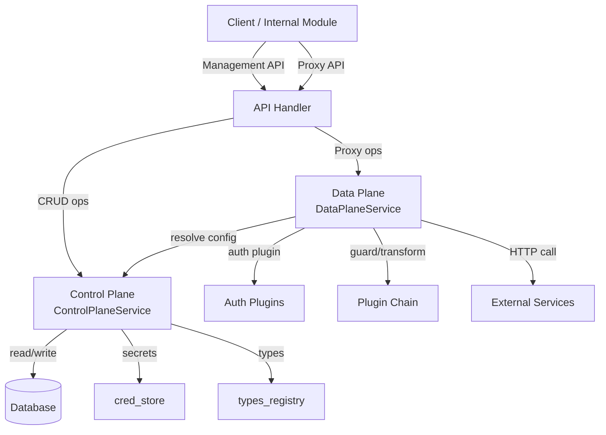
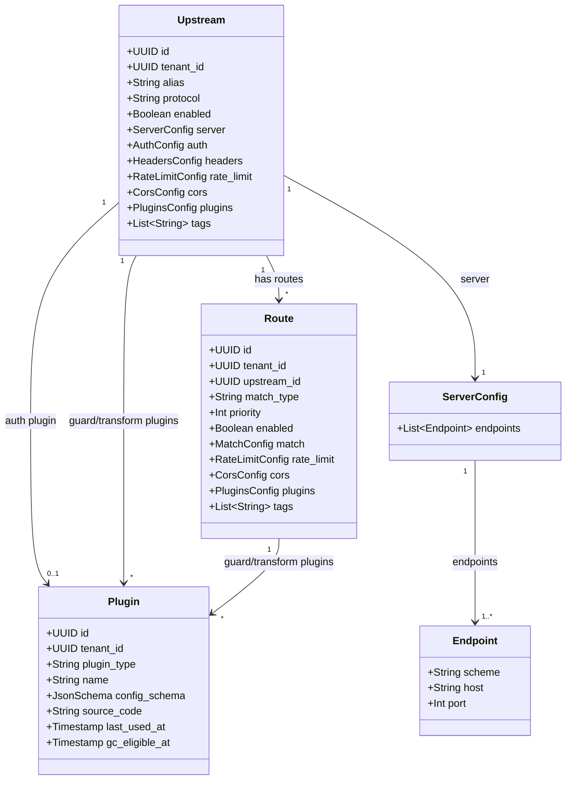
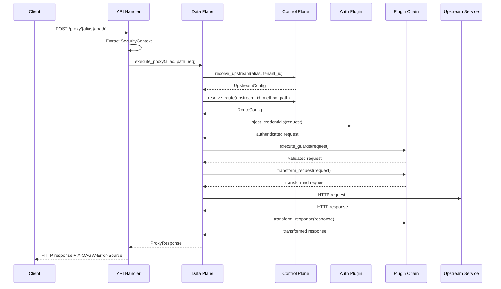

# Technical Design — Outbound API Gateway (OAGW)

## 1. Architecture Overview

### 1.1 Architectural Vision

OAGW is a centralized outbound API gateway that manages all outbound API requests from CyberFabric to external services. It provides routing, authentication, rate limiting, and monitoring through a unified proxy layer that enforces security and observability policies.

The architecture follows a **Control Plane / Data Plane** separation within a single module, where the Control Plane manages configuration data (upstreams, routes, plugins) and the Data Plane orchestrates proxy requests to external services. Both services are implemented as domain traits within a single `oagw` crate, using DDD-Light layering (`domain/infra/api`).

This design satisfies the requirements for centralized outbound traffic management, multi-tenant hierarchical configuration, and extensible plugin-based request processing while remaining practical to implement within CyberFabric's modular monolith architecture.

### 1.2 Architecture Drivers

**ID**: `cpt-cf-oagw-design-drivers`

| Driver | Source | Influence |
|---|---|---|
| Centralized outbound traffic management | `cpt-cf-oagw-fr-request-proxy` | Single proxy endpoint for all external API calls |
| Multi-tenant hierarchy | `cpt-cf-oagw-fr-hierarchical-config` | Configuration sharing/inheritance across tenant tree |
| Plugin extensibility | `cpt-cf-oagw-fr-plugin-system` | Three plugin types (Auth/Guard/Transform) with trait-based isolation |
| Low-latency proxy path | `cpt-cf-oagw-nfr-low-latency` | In-memory rate limiters |
| Credential isolation | `cpt-cf-oagw-nfr-credential-isolation` | Auth via `cred_store` references, no direct secret storage |
| ModKit integration | CyberFabric platform | Single-executable deployment, trait-based DI, secure ORM |

**Architecture Decision Records**:

- `cpt-cf-oagw-adr-component-architecture` — Single module with internal trait-based service isolation
- `cpt-cf-oagw-adr-request-routing` — Path-based routing with alias resolution
- `cpt-cf-oagw-adr-plugin-system` — Three plugin types with deterministic execution order
- `cpt-cf-oagw-adr-rate-limiting` — Token bucket algorithm with hierarchical merge
- `cpt-cf-oagw-adr-circuit-breaker` — State machine with configurable thresholds and fallback
- `cpt-cf-oagw-adr-cors` — Built-in CORS handler with per-upstream/route config
- `cpt-cf-oagw-adr-data-plane-caching` — Control plane caching strategies
- `cpt-cf-oagw-adr-state-management` — CP/DP state structures with cache invalidation
- `cpt-cf-oagw-adr-storage-schema` — Cross-database relational schema with JSON config blobs
- `cpt-cf-oagw-adr-resource-identification` — Layered resource model with alias resolution
- `cpt-cf-oagw-adr-concurrency-control` — Per-scope in-flight request limits
- `cpt-cf-oagw-adr-backpressure-queueing` — Bounded queueing with degradation strategies
- `cpt-cf-oagw-adr-error-source-distinction` — Response header for gateway vs upstream errors
- `cpt-cf-oagw-adr-grpc-support` — HTTP/2 multiplexing with protocol detection
- `cpt-cf-oagw-adr-rust-abi-client-library` — Rust ABI client for internal module routing

### 1.3 Architecture Layers

**ID**: `cpt-cf-oagw-design-layers`

| Layer | Responsibility | Key Components |
|---|---|---|
| **Transport** (`api/rest/`) | HTTP handling, request parsing, response serialization | Axum handlers, DTOs, extractors, OperationBuilder route registration |
| **Domain** (`domain/`) | Business logic, service traits, repository contracts | `ControlPlaneService`, `DataPlaneService`, `AuthPlugin` trait, domain models |
| **Infrastructure** (`infra/`) | External integrations, persistence, HTTP client | SeaORM repositories, reqwest HTTP client, plugin registry, type provisioning |
| **SDK** (`oagw-sdk/`) | Public API for inter-module communication | `ServiceGatewayClientV1` trait, SDK models, error types |

The module follows DDD-Light layering: domain layer has no infrastructure dependencies; infrastructure implements domain traits; transport layer maps between HTTP and domain types.

**ID**: `cpt-cf-oagw-tech-dependencies`

| Technology | Purpose |
|---|---|
| Rust / Axum | HTTP transport, async runtime |
| SeaORM + `modkit-db` | Database persistence (PostgreSQL, MySQL, SQLite) |
| reqwest | Outbound HTTP client (connection pooling, HTTP/2) |
| Starlark | Custom plugin sandboxed execution |
| `modkit-auth` | Bearer token authentication & authorization |
| `cred_store` | Secret material retrieval by URI reference |
| `types_registry` | GTS schema/instance registration |

### 1.4 High-Level Architecture Diagram

**ID**: `cpt-cf-oagw-design-overview`



## 2. Principles & Constraints

### 2.1 Design Principles

**ID**: `cpt-cf-oagw-principle-no-retry`

**No automatic retries**: OAGW never retries failed upstream requests. Retry logic is the client's responsibility.

**ID**: `cpt-cf-oagw-principle-no-cache`

**No response caching**: OAGW does not cache upstream responses. Caching is client/upstream responsibility.

**ID**: `cpt-cf-oagw-principle-cred-isolation`

**Credential isolation**: OAGW references secrets via `cred_store` URIs (`cred://...`); never stores or logs secret material.

**ID**: `cpt-cf-oagw-principle-tenant-scope`

**Tenant scoping**: All database reads/writes use secure ORM with tenant scoping. No raw SQL in module code.

**ID**: `cpt-cf-oagw-principle-plugin-immutable`

**Plugin immutability**: Custom plugins are immutable after creation. Updates create new versions.

**ID**: `cpt-cf-oagw-principle-error-source`

**Error source distinction**: All error responses include `X-OAGW-Error-Source: gateway|upstream` header.

**ID**: `cpt-cf-oagw-principle-rfc9457`

**RFC 9457 Problem Details**: All gateway errors use `application/problem+json` format with GTS type identifiers.

### 2.2 Constraints

**ID**: `cpt-cf-oagw-constraint-modkit-deploy`

Single-executable deployment via ModKit (CyberFabric platform requirement).

**ID**: `cpt-cf-oagw-constraint-no-direct-internet`

No direct internet access from internal modules. Security policy: all outbound traffic routes through OAGW.

**ID**: `cpt-cf-oagw-constraint-multi-sql`

Multi-SQL backend portability: PostgreSQL, MySQL, SQLite. `modkit-db` requirement; avoid backend-specific features for correctness.

**ID**: `cpt-cf-oagw-constraint-body-limit`

Body size hard limit: 100MB. Prevent resource exhaustion; reject before buffering.

**ID**: `cpt-cf-oagw-constraint-https-only`

HTTPS-only for upstream connections in MVP. SSRF prevention; plaintext upstreams explicitly blocked.

## 3. Technical Architecture

### 3.1 Domain Model

**ID**: `cpt-cf-oagw-design-domain-model`



**Key Domain Entities**:

- **Upstream** (`gts.x.core.oagw.upstream.v1~`): Tenant-scoped root configuration object representing an external service. Unique per `(tenant_id, alias)`. Contains server endpoints, auth config, rate limits, CORS, headers, and plugin bindings.
- **Route** (`gts.x.core.oagw.route.v1~`): Belongs to an upstream. Defines match rules (HTTP path/method; gRPC service/method matching is planned for Phase 3 — no gRPC proxy code path is currently implemented or reachable), priority, and route-level overrides for rate limits, CORS, and plugins.
- **Plugin** (`gts.x.core.oagw.{type}_plugin.v1~`): Custom tenant-defined Starlark plugins stored in `oagw_plugin`. Named (built-in) plugins are resolved via in-process registry and not persisted.

#### Upstream Schema

**Base type**: `gts.x.core.oagw.upstream.v1~`

Full schema: [schemas/upstream.v1.schema.json](./schemas/upstream.v1.schema.json)

Sharing fields fragment: [schemas/oagw_upstream_sharing_fields.fragment.json](./schemas/oagw_upstream_sharing_fields.fragment.json)

#### Route Schema

**Base type**: `gts.x.core.oagw.route.v1~`

Full schema: [schemas/route.v1.schema.json](./schemas/route.v1.schema.json)

#### Plugin Schemas

**Auth Plugin** — Base type: `gts.x.core.oagw.auth_plugin.v1~` — [schemas/auth_plugin.v1.schema.json](./schemas/auth_plugin.v1.schema.json)

One per upstream. Named auth plugins resolved via in-process registries, not stored in `oagw_plugin`. UUID-backed auth plugins stored in `oagw_plugin`.

Built-in auth plugins:
- `gts.x.core.oagw.auth_plugin.v1~x.core.oagw.noop.v1`
- `gts.x.core.oagw.auth_plugin.v1~x.core.oagw.apikey.v1`
- `gts.x.core.oagw.auth_plugin.v1~x.core.oagw.basic.v1`
- `gts.x.core.oagw.auth_plugin.v1~x.core.oagw.bearer.v1`
- `gts.x.core.oagw.auth_plugin.v1~x.core.oagw.oauth2_client_cred.v1`
- `gts.x.core.oagw.auth_plugin.v1~x.core.oagw.oauth2_client_cred_basic.v1`

**Guard Plugin** — Base type: `gts.x.core.oagw.guard_plugin.v1~` — [schemas/guard_plugin.v1.schema.json](./schemas/guard_plugin.v1.schema.json)

Multiple per upstream/route. Can reject requests before they reach upstream.

| Plugin ID | Description |
|---|---|
| `gts.x.core.oagw.guard_plugin.v1~x.core.oagw.timeout.v1` | Request timeout enforcement |
| `gts.x.core.oagw.guard_plugin.v1~x.core.oagw.cors.v1` | CORS preflight validation |

Circuit breaker is **core functionality** (not a plugin). See [ADR: Circuit Breaker](./ADR/0005-circuit-breaker.md).

**Transform Plugin** — Base type: `gts.x.core.oagw.transform_plugin.v1~` — [schemas/transform_plugin.v1.schema.json](./schemas/transform_plugin.v1.schema.json)

Multiple per upstream/route, executed in order. Each plugin declares supported phases: `on_request`, `on_response`, `on_error`.

| Plugin ID | Phase | Description |
|---|---|---|
| `gts.x.core.oagw.transform_plugin.v1~x.core.oagw.logging.v1` | request, response, error | Request/response logging |
| `gts.x.core.oagw.transform_plugin.v1~x.core.oagw.metrics.v1` | request, response | Prometheus metrics |
| `gts.x.core.oagw.transform_plugin.v1~x.core.oagw.request_id.v1` | request, response | X-Request-ID injection/propagation |

#### Plugin Identification Model

All plugins are identified using **GTS identifiers** in the API layer.

The database stores:
- `plugin_ref` (TEXT): the canonical plugin identifier string (full GTS identifier).
- `plugin_uuid` (UUID, nullable): extracted UUID when `plugin_ref` is UUID-backed.

**Named plugins** (built-in or provided by deployed modules):
- API: `gts.x.core.oagw.{type}_plugin.v1~x.core.oagw.{name}.v1`
- Resolved via an in-process plugin registry.
- Not stored in `oagw_plugin` and not subject to GC.

**Custom plugins** (tenant-defined Starlark):
- API: `gts.x.core.oagw.{type}_plugin.v1~{uuid}`
- Stored in `oagw_plugin` keyed by `id = {uuid}`.

**Bindings**:
- `oagw_upstream_plugin` / `oagw_route_plugin` store `(position, plugin_ref, plugin_uuid, config)`.
- No FK from binding rows to `oagw_plugin` because named plugins do not have DB rows.
- Application validates that `plugin_uuid` matches `plugin_ref` when present.

**Auth plugin storage**: Upstreams store auth plugin identity in scalar columns (`auth_plugin_ref`, `auth_plugin_uuid`) so "plugin in use" checks do not depend on JSON scanning.

**Resolution Algorithm**:
1. Parse GTS identifier from API request to extract instance part (after `~`)
2. If instance parses as UUID → resolve via `oagw_plugin` (must exist and must match the plugin schema type)
3. Otherwise → resolve via in-process registry (named plugins)
4. When persisting bindings, store `plugin_ref` always; store `plugin_uuid` only for UUID-backed plugins

### 3.2 Component Model

**ID**: `cpt-cf-oagw-component-model`

#### Module Structure

```text
modules/system/oagw/
├── oagw-sdk/              # Public API: ServiceGatewayClientV1 trait, models, errors
│   └── src/
│       ├── lib.rs         # Re-exports
│       ├── api.rs         # ServiceGatewayClientV1 trait definition
│       ├── models.rs      # SDK types (Upstream, Route, CreateUpstreamRequest, etc.)
│       └── error.rs       # ServiceGatewayError
│
└── oagw/                  # Single module crate with internal service isolation
    └── src/
        ├── lib.rs         # Public exports
        ├── module.rs      # ModKit module wiring
        ├── config.rs      # OagwConfig
        ├── api/rest/      # Transport layer
        │   ├── handlers/  # Axum HTTP handlers (management + proxy)
        │   ├── routes/    # OperationBuilder route registration
        │   ├── dto.rs     # REST DTOs (serde + utoipa)
        │   ├── error.rs   # Error response mapping
        │   └── extractors.rs
        ├── domain/        # Business logic (no infra dependencies)
        │   ├── services/  # ControlPlaneService + DataPlaneService traits & impls
        │   ├── plugin/    # AuthPlugin trait definition
        │   ├── dto.rs     # Internal domain types (ProxyContext, ProxyResponse, etc.)
        │   ├── repo.rs    # Repository traits (UpstreamRepository, RouteRepository)
        │   └── error.rs   # DomainError
        └── infra/         # Infrastructure implementations
            ├── proxy/     # DataPlaneServiceImpl (reqwest HTTP client)
            ├── storage/   # Repository impls (SeaORM-based)
            ├── plugin/    # AuthPluginRegistry + built-in plugins (ApiKey, NoOp)
            └── type_provisioning.rs  # GTS type registration
```

#### Internal Services

- **ControlPlaneService** (`domain/services/management.rs`): Manages configuration data. Handles CRUD operations for upstreams/routes, alias resolution, and repository access.
- **DataPlaneService** (`infra/proxy/service.rs`): Orchestrates proxy requests. Resolves config via Control Plane, executes auth plugins, builds outbound HTTP requests, and forwards to upstream services.

**Crate Naming**: Directory names hyphenated (`oagw-sdk`), package names `cf-` prefixed (`cf-oagw-sdk`), library names underscored (`oagw_sdk`).

#### Request Routing

| Path Pattern | Routed To | Purpose |
|---|---|---|
| `/api/oagw/v1/upstreams/*` | Control Plane | Upstream CRUD |
| `/api/oagw/v1/routes/*` | Control Plane | Route CRUD |
| `/api/oagw/v1/plugins/*` | Control Plane | Plugin CRUD |
| `/api/oagw/v1/proxy/*` | Data Plane | Proxy requests |

#### Plugin System

Three plugin types with separate traits, deterministic execution order:

1. **AuthPlugin** (`gts.x.core.oagw.auth_plugin.v1~*`): Credential injection. One per upstream.
2. **GuardPlugin** (`gts.x.core.oagw.guard_plugin.v1~*`): Validation/policy enforcement (can reject). Multiple per upstream/route.
3. **TransformPlugin** (`gts.x.core.oagw.transform_plugin.v1~*`): Request/response mutation. Multiple per upstream/route.

Execution order: Auth → Guards → Transform(on_request) → Upstream call → Transform(on_response/on_error).

Plugin chain composition: upstream plugins execute before route plugins (`[U1, U2] + [R1, R2] => [U1, U2, R1, R2]`).

**Built-in Plugins**:
- Auth: `noop`, `apikey`, `basic`, `bearer`, `oauth2_client_cred`, `oauth2_client_cred_basic`
- Guard: `timeout`, `cors`
- Transform: `logging`, `metrics`, `request_id`

**Custom Plugins**: Starlark scripts with sandboxed execution (no network/file I/O, timeout/memory limits enforced). Immutable after creation; GC for unlinked plugins after configurable TTL.

#### Hierarchical Configuration

Multi-tenant hierarchy with sharing modes (`private`/`inherit`/`enforce`) per configuration field:

| Field | Merge Strategy |
|---|---|
| Auth | Override if `inherit`; forced if `enforce` |
| Rate Limits | `min(ancestor, descendant)` — stricter always wins |
| Plugins | Concatenate: `ancestor.plugins + descendant.plugins` |
| Tags | Union (add-only); descendants cannot remove inherited tags |
| CORS | Union origins if `inherit`; forced if `enforce` |

Alias resolution walks tenant hierarchy from descendant to root; closest match wins (shadowing). Enforced ancestor constraints are never bypassed by shadowing.

#### Alias Resolution

Upstreams are identified by alias in proxy requests: `{METHOD} /api/oagw/v1/proxy/{alias}/{path}`.

**Alias Generation Rules**:

| Scenario | Generated Alias | Example |
|---|---|---|
| Single host, standard port | hostname (no port) | `api.openai.com:443` → `api.openai.com` |
| Single host, non-standard port | hostname:port | `api.openai.com:8443` → `api.openai.com:8443` |
| Multiple hosts with common suffix | common domain suffix | `us.vendor.com`, `eu.vendor.com` → `vendor.com` |
| IP addresses or heterogeneous hosts | must be explicit | `10.0.1.1`, `10.0.1.2` → user provides `my-service` |

**Standard ports** (omitted from alias): HTTP: 80, HTTPS: 443, WebSocket: 80 (ws) / 443 (wss), WebTransport: 443, gRPC: 443.

**Alias Uniqueness**: Alias is unique **per tenant**, not globally. Database constraint: `UNIQUE (tenant_id, alias)`. Tenants can independently manage upstreams without namespace collisions. Descendants can shadow ancestor aliases for controlled customization.

**Shadowing Behavior**: When resolving alias, OAGW walks tenant hierarchy from descendant to root. Closest match wins. Shadowing selects the routing target only — ancestor constraints configured with `sharing: enforce` remain active. Effective limits are computed with enforced ancestors included (e.g., `effective_rate = min(selected_rate, route_rate, all_ancestor_enforced_rates)`).

**Multi-Endpoint Load Balancing**: Multiple endpoints in the same upstream form a pool. Requests are distributed across endpoints (round-robin). All endpoints must have the same `protocol`, `scheme`, and `port`.

#### Headers Transformation

OAGW processes headers in three categories:

1. **Routing Headers**: Consumed by OAGW during request routing and NOT forwarded to upstream services.
2. **Hop-by-Hop Headers**: Stripped by default according to HTTP specifications.
3. **Passthrough Headers**: Forwarded to upstream according to configuration rules.

| Inbound Header | Rule |
|---|---|
| `X-OAGW-Target-Host` | Read during routing, then stripped |
| `Host` | Replaced by upstream host |
| `Connection` | Stripped |
| `Keep-Alive` | Stripped |
| `Proxy-Authenticate` | Stripped |
| `Proxy-Authorization` | Stripped |
| `TE` | Stripped |
| `Trailer` | Stripped |
| `Transfer-Encoding` | Stripped |
| `Upgrade` | Stripped |

Simple header transformations are defined in the upstream `headers` configuration. Complex header transformations can be defined in corresponding upstream/route plugins. Well-known headers (e.g., `Content-Length`, `Content-Type`) must be validated, set or adjusted; invalid headers should result in `400 Bad Request`.

**HTTP/2 `:authority` Pseudo-Header and X-OAGW-Target-Host**:

In HTTP/2, the `:authority` pseudo-header replaces the HTTP/1.1 `Host` header. OAGW's `X-OAGW-Target-Host` header behavior applies consistently across both protocols:
- **HTTP/1.1**: `X-OAGW-Target-Host` is used for routing; standard `Host` header is replaced with upstream host
- **HTTP/2**: `X-OAGW-Target-Host` is used for routing; `:authority` pseudo-header is replaced with upstream authority
- The `:authority` pseudo-header does NOT replace `X-OAGW-Target-Host` for routing purposes. Both headers serve different functions.

#### Guard Rules

Validation rules that can reject requests:

| Inbound | Rule |
|---|---|
| Method | Must be in `match.http.methods`; reject if not allowed |
| Query params | Validate against `match.http.query_allowlist`; reject if unknown |
| Path suffix | Reject if `path_suffix_mode`: `disabled` and suffix provided |
| Body | See body validation rules below |
| CORS | Reject if CORS policy validation fails |

#### Body Validation Rules

Default validation checks (no configuration required):

| Check | Rule | Error |
|---|---|---|
| Content-Length | Must be valid integer if present; must match actual size | `400 ValidationError` |
| Max size | Hard limit 100MB; reject before buffering | `413 PayloadTooLarge` |
| Transfer-Encoding | Reject unsupported encodings (only `chunked` supported) | `400 ValidationError` |

Additional validation (JSON Schema, content-type checks, custom rules) implemented via guard plugins.

#### Transformation Rules

Rules that mutate inbound → outbound:

| Inbound | Outbound | Rule |
|---|---|---|
| Method | Method | Passthrough |
| Path suffix | Path | Append to `match.http.path` if `path_suffix_mode`: `append`; plugin mutable |
| Query params | Query | Passthrough allowed params; plugin mutable |
| Headers | Headers | Apply `upstream.headers` transformation rules; plugin mutable |
| Body | Body | Passthrough by default; plugin mutable |

#### Plugin Lifecycle Management

**Custom Plugins** (Starlark):
- **Immutable**: Plugins cannot be updated after creation
- **Versioning**: Create new plugin for changes, update upstream/route references
- **Deletion**: Only unlinked plugins can be deleted
- **Garbage Collection**: Unlinked plugins are automatically deleted after TTL (default: 30 days). A periodic GC job marks plugins eligible by setting `gc_eligible_at` when they become unlinked, and deletes plugin rows once `gc_eligible_at` is in the past.

**Named plugins**: Not stored in `oagw_plugin`. Resolved via in-process registry. Not subject to GC.

#### Secret Access Control

Auth configuration references secrets via `secret_ref` (e.g., `cred://partner-openai-key`). OAGW does not manage secret sharing — this is handled by `cred_store`.

**Resolution flow**:
1. OAGW resolves `secret_ref` via `cred_store` API
2. `cred_store` checks if secret is accessible to current tenant (own or shared by ancestor)
3. If accessible → return secret material
4. If not → return error, OAGW returns 401 Unauthorized

Ancestor can share a secret with descendants via `cred_store` policies. Descendant can also use own secret with different `secret_ref`.

#### Permissions and Access Control

Descendant's ability to override configurations depends on permissions granted by ancestors:

| Permission | Allows Descendant To |
|---|---|
| `oagw:upstream:bind` | Create binding to ancestor's upstream |
| `oagw:upstream:override_auth` | Override auth config (if sharing: inherit) |
| `oagw:upstream:override_rate` | Specify own rate limits (subject to min()) |
| `oagw:upstream:add_plugins` | Append own plugins to inherited chain |

Without appropriate permissions, descendant must use ancestor's configuration as-is (even with `sharing: inherit`).

#### Security Considerations

**Server-Side Request Forgery (SSRF)**:
- DNS: IP pinning rules, allowed segments matching.
- Headers: Well-known headers stripping and validation.
- Request Validation: Path, query parameters validation against route configuration.

**Cross-Origin Resource Sharing (CORS)**: Built-in, configured per upstream/route. Preflight OPTIONS requests handled locally (no upstream round-trip). See [ADR: CORS](./ADR/0006-cors.md).

**HTTP Version Negotiation**: OAGW uses adaptive per-host HTTP version detection:
1. **First request**: Attempt HTTP/2 via ALPN during TLS handshake
2. **Success**: Cache "HTTP/2 supported" for this host/IP
3. **Failure**: Fallback to HTTP/1.1, cache "HTTP/1.1 only" for this host/IP
4. **Subsequent requests**: Use cached protocol version

Cache entry TTL: 1 hour. HTTP/3 (QUIC) support is future work.

**Inbound Authentication & Authorization**: All OAGW API requests require Bearer token authentication.

**Management API** permissions:

| Permission Required | Description |
|---|---|
| `gts.x.core.oagw.upstream.v1~:{create;override;read;delete}` | Create/Override, read, delete upstream |
| `gts.x.core.oagw.route.v1~:{create;override;read;delete}` | Create/Override, read, delete route |
| `gts.x.core.oagw.auth_plugin.v1~:{create;read;delete}` | Create, read, delete auth plugin |
| `gts.x.core.oagw.guard_plugin.v1~:{create;read;delete}` | Create, read, delete guard plugin |
| `gts.x.core.oagw.transform_plugin.v1~:{create;read;delete}` | Create, read, delete transform plugin |

**Proxy API** permissions:

| Permission Required | Description |
|---|---|
| `gts.x.core.oagw.proxy.v1~:invoke` | Proxy requests to upstreams |

Authorization checks:
1. Token must have `gts.x.core.oagw.proxy.v1~:invoke` permission
2. Upstream must be owned by token's tenant or shared by ancestor
3. Route must match request method and path

**Outbound Authentication** (OAGW → Upstream): Handled by auth plugins. Token refresh/caching may occur as part of credential preparation, but OAGW does not re-issue failed upstream requests.

**Retry Policy**: OAGW does not retry failed requests. Clients responsible for retry logic. Auth plugins handle token refresh on 401, but do not retry the original request.

### 3.3 API Contracts

**ID**: `cpt-cf-oagw-interface-api`

#### Management API

| Method | Path | Description |
|---|---|---|
| `POST` | `/api/oagw/v1/upstreams` | Create upstream |
| `GET` | `/api/oagw/v1/upstreams` | List upstreams |
| `GET` | `/api/oagw/v1/upstreams/{id}` | Get upstream by ID |
| `PUT` | `/api/oagw/v1/upstreams/{id}` | Update upstream |
| `DELETE` | `/api/oagw/v1/upstreams/{id}` | Delete upstream |
| `POST` | `/api/oagw/v1/routes` | Create route |
| `GET` | `/api/oagw/v1/routes` | List routes |
| `GET` | `/api/oagw/v1/routes/{id}` | Get route by ID |
| `PUT` | `/api/oagw/v1/routes/{id}` | Update route |
| `DELETE` | `/api/oagw/v1/routes/{id}` | Delete route |
| `POST` | `/api/oagw/v1/plugins` | Create plugin |
| `GET` | `/api/oagw/v1/plugins` | List plugins |
| `GET` | `/api/oagw/v1/plugins/{id}` | Get plugin by ID |
| `DELETE` | `/api/oagw/v1/plugins/{id}` | Delete plugin |
| `GET` | `/api/oagw/v1/plugins/{id}/source` | Get Starlark source |

IDs use anonymous GTS identifiers: `gts.x.core.oagw.{type}.v1~{uuid}`. Plugins are immutable (no PUT). DELETE returns `409 PluginInUse` when referenced.

List endpoints support OData query parameters: `$filter`, `$select`, `$orderby`, `$top`, `$skip`.

**Upstream List Query Parameters**:

| Parameter | Type | Description |
|---|---|---|
| `$filter` | string | OData filter expression (e.g., `alias eq 'api.openai.com'`) |
| `$select` | string | Fields to return (e.g., `id,alias,server`) |
| `$orderby` | string | Sort order (e.g., `created_at desc`) |
| `$top` | integer | Max results (default: 50, max: 100) |
| `$skip` | integer | Offset for pagination |

**Route List Query Parameters**:

| Parameter | Type | Description |
|---|---|---|
| `$filter` | string | OData filter (e.g., `upstream_id eq '{uuid}'`) |
| `$select` | string | Fields to return |
| `$orderby` | string | Sort order |
| `$top` | integer | Max results (default: 50, max: 100) |
| `$skip` | integer | Offset for pagination |

**Plugin List Query Parameters**:

| Parameter | Type | Description |
|---|---|---|
| `$filter` | string | OData filter (e.g., `type eq 'guard'`) |
| `$select` | string | Fields to return |
| `$top` | integer | Max results |
| `$skip` | integer | Offset for pagination |

#### Proxy API

`{METHOD} /api/oagw/v1/proxy/{alias}[/{path_suffix}][?{query_parameters}]`

Request classification uses `upstream.protocol` to determine match strategy:
- HTTP: method allowlist + longest path prefix match
- gRPC (planned/Phase 3): `(service, method)` match from gRPC request path (no gRPC proxy code path is currently implemented or reachable)

#### Error Response Format

All gateway errors follow RFC 9457 Problem Details (`application/problem+json`) with GTS `type` identifiers.

| Error Type | HTTP | GTS Instance ID | Retriable | Description |
|---|---|---|---|---|
| RouteError | 400 | `gts.x.core.errors.err.v1~x.oagw.validation.error.v1` | No | General route validation error |
| ValidationError | 400 | `gts.x.core.errors.err.v1~x.oagw.validation.error.v1` | No | Request validation failed |
| MissingTargetHost | 400 | `gts.x.core.errors.err.v1~x.oagw.routing.missing_target_host.v1` | No | X-OAGW-Target-Host header required for multi-endpoint upstream with common suffix alias |
| InvalidTargetHost | 400 | `gts.x.core.errors.err.v1~x.oagw.routing.invalid_target_host.v1` | No | X-OAGW-Target-Host header format is invalid (must be hostname or IP, no port/path/special chars) |
| UnknownTargetHost | 400 | `gts.x.core.errors.err.v1~x.oagw.routing.unknown_target_host.v1` | No | X-OAGW-Target-Host value does not match any configured endpoint |
| AuthenticationFailed | 401 | `gts.x.core.errors.err.v1~x.oagw.auth.failed.v1` | No | Authentication to upstream failed |
| RouteNotFound | 404 | `gts.x.core.errors.err.v1~x.oagw.route.not_found.v1` | No | No matching route found |
| PluginInUse | 409 | `gts.x.core.errors.err.v1~x.oagw.plugin.in_use.v1` | No | Plugin in use |
| PayloadTooLarge | 413 | `gts.x.core.errors.err.v1~x.oagw.payload.too_large.v1` | No | Request payload exceeds limit |
| RateLimitExceeded | 429 | `gts.x.core.errors.err.v1~x.oagw.rate_limit.exceeded.v1` | Yes | Rate limit exceeded |
| SecretNotFound | 500 | `gts.x.core.errors.err.v1~x.oagw.secret.not_found.v1` | No | Referenced secret not found |
| ProtocolError | 502 | `gts.x.core.errors.err.v1~x.oagw.protocol.error.v1` | No | Protocol-level error |
| DownstreamError | 502 | `gts.x.core.errors.err.v1~x.oagw.downstream.error.v1` | Depends | Upstream service error |
| StreamAborted | 502 | `gts.x.core.errors.err.v1~x.oagw.stream.aborted.v1` | No | Stream connection aborted |
| LinkUnavailable | 503 | `gts.x.core.errors.err.v1~x.oagw.link.unavailable.v1` | Yes | Upstream link unavailable |
| CircuitBreakerOpen | 503 | `gts.x.core.errors.err.v1~x.oagw.circuit_breaker.open.v1` | Yes | Circuit breaker open |
| PluginNotFound | 503 | `gts.x.core.errors.err.v1~x.oagw.plugin.not_found.v1` | No | Plugin not found |
| ConnectionTimeout | 504 | `gts.x.core.errors.err.v1~x.oagw.timeout.connection.v1` | Yes | Connection timeout |
| RequestTimeout | 504 | `gts.x.core.errors.err.v1~x.oagw.timeout.request.v1` | Yes | Request timeout |
| IdleTimeout | 504 | `gts.x.core.errors.err.v1~x.oagw.timeout.idle.v1` | Yes | Idle timeout |

**Standard Fields** (RFC 9457):
- `type`: GTS identifier for the error type (used for programmatic error handling)
- `title`: Human-readable summary
- `status`: HTTP status code
- `detail`: Human-readable explanation specific to this occurrence
- `instance`: URI reference identifying the specific occurrence

**Extension Fields** (OAGW-specific):
- `upstream_id`, `host`, `path`: Request context
- `retry_after_seconds`: Retry guidance
- `trace_id`: For distributed tracing correlation

#### Error Source Distinction

OAGW distinguishes between **gateway errors** (originated by OAGW) and **upstream errors** (passthrough from upstream service) using the `X-OAGW-Error-Source` header. See [ADR: Error Source Distinction](./ADR/0013-error-source-distinction.md).

- **Gateway error**: `X-OAGW-Error-Source: gateway` — response body is `application/problem+json`
- **Upstream error**: `X-OAGW-Error-Source: upstream` — response body is passthrough from upstream as-is

Header may be stripped by intermediaries. For critical error handling, clients should combine header check with error response structure inspection.

#### Authentication & Authorization

**Inbound** (Client → OAGW): Bearer token authentication via `modkit-auth`.

| Permission | Description |
|---|---|
| `gts.x.core.oagw.upstream.v1~:{create;override;read;delete}` | Upstream CRUD |
| `gts.x.core.oagw.route.v1~:{create;override;read;delete}` | Route CRUD |
| `gts.x.core.oagw.proxy.v1~:invoke` | Proxy requests |

**Outbound** (OAGW → Upstream): Handled by auth plugins. Credentials resolved from `cred_store` via `secret_ref`.

### 3.4 Internal & External Dependencies

**ID**: `cpt-cf-oagw-design-dependencies`

| Dependency | Type | Purpose |
|---|---|---|
| `types_registry` | Internal | GTS schema/instance registration |
| `cred_store` | Internal | Secret material retrieval by URI reference |
| `api_ingress` | Internal | REST API hosting |
| `modkit-db` | Internal | Database persistence (SeaORM, multi-backend) |
| `modkit-auth` | Internal | Authentication & authorization |
| `reqwest` | External | Outbound HTTP client |

### 3.5 Interactions & Sequences

**ID**: `cpt-cf-oagw-seq-proxy-flow`

#### Proxy Request Flow



#### Management Operation Flow

```text
Client → API Handler (auth, validate DTO) → ControlPlaneService (validate, write DB) → Response
```

### 3.6 Database Schemas & Tables

**ID**: `cpt-cf-oagw-db-schema`

Schema follows portable relational baseline with JSON blobs for evolving configuration. See [ADR: Storage Schema](./ADR/0009-storage-schema.md) for full details.

#### Core Tables

| Table | Purpose | Key Constraints |
|---|---|---|
| `oagw_upstream` | Tenant-scoped root config | PK: `id`, UNIQUE: `(tenant_id, alias)` |
| `oagw_route` | Route definitions | PK: `id`, FK: `upstream_id` (cascade) |
| `oagw_route_http_match` | HTTP match keys | PK: `route_id`, FK: cascade |
| `oagw_route_grpc_match` | gRPC match keys | PK: `route_id`, FK: cascade |
| `oagw_route_method` | HTTP method allowlists | PK: `(route_id, method)`, FK: cascade |
| `oagw_upstream_tag` / `oagw_route_tag` | Discovery tags | PK: `(parent_id, tag)`, FK: cascade |
| `oagw_plugin` | Custom plugins (UUID-backed) | PK: `id`, UNIQUE: `(tenant_id, name)` |
| `oagw_upstream_plugin` / `oagw_route_plugin` | Ordered plugin bindings | PK: `(parent_id, position)`, FK: cascade |

#### Key Invariants

- All reads/writes tenant-scoped through secure ORM (no raw SQL)
- Multi-table updates are atomic (single transaction)
- Route match determinism: no two enabled routes under same upstream may share `(path_prefix, priority)` for same method
- Plugin binding positions contiguous from 0, validated on write
- Named plugins referenced via `plugin_ref` with `plugin_uuid = NULL`; custom plugins have both

#### Resource Identification Pattern

All resources use anonymous GTS identifiers in API path parameters:
- Upstreams: `gts.x.core.oagw.upstream.v1~{uuid}`
- Routes: `gts.x.core.oagw.route.v1~{uuid}`
- Plugins: `gts.x.core.oagw.{type}_plugin.v1~{uuid}`

See [ADR: Resource Identification](./ADR/0010-resource-identification.md) for the layered resource model.

#### Common Queries

| Query | Description |
|---|---|
| Find Upstream by Alias | Lookup by `(tenant_id, alias)` with tenant hierarchy walk and `enabled` inheritance |
| List Upstreams for Tenant | List with shadowing (closest tenant wins) and `enabled` inheritance |
| Find Matching Route for Request | Match by `(upstream_id, method, longest path prefix, priority)` for HTTP; `(upstream_id, service, method)` for gRPC (planned/Phase 3 — no gRPC proxy code path is currently implemented or reachable) |
| Resolve Effective Configuration | Walk hierarchy, collect bindings, merge from root to child per sharing modes |
| List Routes by Upstream | Filter by `upstream_id` with tenant scoping |
| Track Plugin Usage | Scan `oagw_upstream_plugin`, `oagw_route_plugin`, and `auth_plugin_uuid` columns for references |
| Delete Garbage-Collected Plugins | Delete plugin rows where `gc_eligible_at` is in the past |

## 4. Additional Context

### 4.1 Caching Strategy

OAGW does not cache upstream responses. Caching is client/upstream responsibility.

Config caching (in-memory caching of effective upstream/route configuration to avoid DB reads on every proxy request) is a future consideration. See [ADR: Control Plane Caching](./ADR/0007-data-plane-caching.md) for design direction.

### 4.2 Metrics and Observability

Prometheus metrics at `/metrics` (admin-only):

- `oagw_requests_total{host, path, method, status_class}` — counter
- `oagw_request_duration_seconds{host, path, phase}` — histogram
- `oagw_requests_in_flight{host}` — gauge
- `oagw_errors_total{host, path, error_type}` — counter
- `oagw_circuit_breaker_state{host}` — gauge
- `oagw_rate_limit_exceeded_total{host, path}` — counter

**Circuit Breaker Metrics**:
- `oagw_circuit_breaker_transitions_total{host, from_state, to_state}` — counter

**Rate Limit Metrics**:
- `oagw_rate_limit_usage_ratio{host, path}` — gauge (0.0 to 1.0)

**Routing Metrics**:
- `oagw_routing_target_host_used{upstream_id, endpoint_host}` — counter (tracks X-OAGW-Target-Host usage)
- `oagw_routing_endpoint_selected{upstream_id, endpoint_host, selection_method}` — counter (selection_method: `explicit_header`, `round_robin`, `default`)

**Upstream Health Metrics**:
- `oagw_upstream_available{host, endpoint}` — gauge (0=down, 1=up)
- `oagw_upstream_connections{host, state}` — gauge (state: `idle`, `active`, `max`)

Cardinality management: no tenant labels, normalized paths from route config, status class grouping (2xx/3xx/4xx/5xx).

**Histogram Buckets** (request duration, seconds): `[0.001, 0.005, 0.01, 0.025, 0.05, 0.1, 0.25, 0.5, 1.0, 2.5, 5.0, 10.0]`

### 4.3 Audit Logging

Structured JSON logs to stdout, ingested by centralized logging system (e.g., ELK, Loki). Fields: `timestamp`, `level`, `event`, `request_id`, `tenant_id`, `principal_id`, `host`, `path`, `method`, `status`, `duration_ms`, `request_size`, `response_size`, `error_type`.

**No PII**: Never log request/response bodies, query parameters, or headers (except allowlisted). **No secrets**: Never log API keys, tokens, or credentials. High-frequency sampling: rate-limited to prevent excessive log volume (e.g., sample 1/100 for high-volume routes).

**What is Logged**:
- **Success requests**: Request ID, tenant, host, path, method, status, duration, sizes
- **Failed requests**: All above + error_type, error_message
- **Config changes**: Upstream/route create/update/delete operations
- **Auth failures**: Failed authentication attempts (rate limited to prevent log flooding)
- **Circuit breaker events**: State transitions (CLOSED→OPEN, OPEN→HALF_OPEN, etc.)

**Log Levels**:
- `INFO`: Successful requests, normal operations
- `WARN`: Rate limit exceeded, circuit breaker open, retry guidance emitted (`Retry-After`)
- `ERROR`: Upstream failures, timeouts, auth failures
- `DEBUG`: Detailed plugin execution (disabled in production)

### 4.4 Security Considerations

- **SSRF**: IP pinning rules, allowed segments, scheme allowlist (HTTPS-only for MVP)
- **CORS**: Built-in handler per upstream/route, secure defaults (disabled unless configured)
- **HTTP smuggling**: Strict header parsing, reject CR/LF, validate CL/TE combinations
- **HTTP/2**: Adaptive per-host version detection with cached capability (1h TTL)

### 4.5 Out of Scope

- DNS resolution / IP pinning rules (separate concern)
- Plugin versioning and lifecycle management (separate concern)
- Response caching (client/upstream responsibility)
- Automatic retries (client responsibility)
- HTTP/3 (QUIC) support (future)

### 4.6 Review

1. Database schema, indexing and queries
2. [ADR: Rust ABI / Client Libraries](./ADR/0015-rust-abi-client-library.md) — HTTP client abstractions, streaming support, plugin development APIs

### 4.7 Future Developments

1. [Core] Circuit breaker: config and fallback strategies — [ADR: Circuit Breaker](./ADR/0005-circuit-breaker.md)
2. [Core] Concurrency control — [ADR: Concurrency Control](./ADR/0011-concurrency-control.md)
3. [Core] Backpressure queueing — [ADR: Backpressure](./ADR/0012-backpressure-queueing.md) — In-flight limits, queueing strategies, graceful degradation under load
4. [Plugin] Starlark standard library extensions (e.g., HTTP client, caching), with security considerations. Auth plugins may need network I/O.
5. [Security] TLS certificate pinning — Pin specific certificates/public keys for critical upstreams to prevent MITM attacks
6. [Security] mTLS support — Mutual TLS for client certificate authentication with upstream services
7. [Protocol] gRPC support — HTTP/2 multiplexing with content-type detection — [ADR: gRPC Support](./ADR/0014-grpc-support.md) — **Requires prototype**

## 5. Traceability

### 5.1 PRD Coverage

| PRD Requirement | Design Element |
|---|---|
| `cpt-cf-oagw-fr-upstream-mgmt` | `cpt-cf-oagw-component-model` — Control Plane handles upstream CRUD |
| `cpt-cf-oagw-fr-route-mgmt` | `cpt-cf-oagw-component-model` — Control Plane handles route CRUD |
| `cpt-cf-oagw-fr-request-proxy` | `cpt-cf-oagw-seq-proxy-flow` — Data Plane proxy request flow |
| `cpt-cf-oagw-fr-plugin-system` | `cpt-cf-oagw-component-model` — Three plugin types with trait-based extensibility |
| `cpt-cf-oagw-fr-rate-limiting` | `cpt-cf-oagw-component-model` — Token bucket with dual-rate config |
| `cpt-cf-oagw-fr-hierarchical-config` | `cpt-cf-oagw-component-model` — Sharing modes and merge strategies |
| `cpt-cf-oagw-fr-alias-resolution` | `cpt-cf-oagw-component-model` — Alias resolution with shadowing |
| `cpt-cf-oagw-fr-streaming` | `cpt-cf-oagw-interface-api` — SSE, WebSocket, gRPC streaming |
| `cpt-cf-oagw-nfr-low-latency` | `cpt-cf-oagw-tech-dependencies` — In-memory rate limiters |
| `cpt-cf-oagw-nfr-multi-tenancy` | `cpt-cf-oagw-db-schema` — All tables tenant-scoped via secure ORM |
| `cpt-cf-oagw-nfr-observability` | `cpt-cf-oagw-interface-api` — Prometheus metrics, structured logging |
| `cpt-cf-oagw-nfr-credential-isolation` | `cpt-cf-oagw-principle-cred-isolation` — `cred_store` secret references |

### 5.2 ADR Coverage

| ADR | Design Element |
|---|---|
| [0001 Component Architecture](./ADR/0001-component-architecture.md) | `cpt-cf-oagw-component-model` |
| [0002 Request Routing](./ADR/0002-request-routing.md) | `cpt-cf-oagw-component-model`, `cpt-cf-oagw-seq-proxy-flow` |
| [0003 Plugin System](./ADR/0003-plugin-system.md) | `cpt-cf-oagw-component-model` |
| [0004 Rate Limiting](./ADR/0004-rate-limiting.md) | `cpt-cf-oagw-component-model` |
| [0005 Circuit Breaker](./ADR/0005-circuit-breaker.md) | `cpt-cf-oagw-interface-api` |
| [0006 CORS](./ADR/0006-cors.md) | `cpt-cf-oagw-component-model` |
| [0007 Control Plane Caching](./ADR/0007-data-plane-caching.md) | `cpt-cf-oagw-tech-dependencies` |
| [0008 State Management](./ADR/0008-state-management.md) | `cpt-cf-oagw-component-model` |
| [0009 Storage Schema](./ADR/0009-storage-schema.md) | `cpt-cf-oagw-db-schema` |
| [0010 Resource Identification](./ADR/0010-resource-identification.md) | `cpt-cf-oagw-design-domain-model` |
| [0011 Concurrency Control](./ADR/0011-concurrency-control.md) | `cpt-cf-oagw-component-model` |
| [0012 Backpressure and Queueing](./ADR/0012-backpressure-queueing.md) | `cpt-cf-oagw-component-model` |
| [0013 Error Source Distinction](./ADR/0013-error-source-distinction.md) | `cpt-cf-oagw-interface-api` |
| [0014 gRPC Support](./ADR/0014-grpc-support.md) | `cpt-cf-oagw-interface-api` |
| [0015 Rust ABI Client Library](./ADR/0015-rust-abi-client-library.md) | `cpt-cf-oagw-tech-dependencies` |
